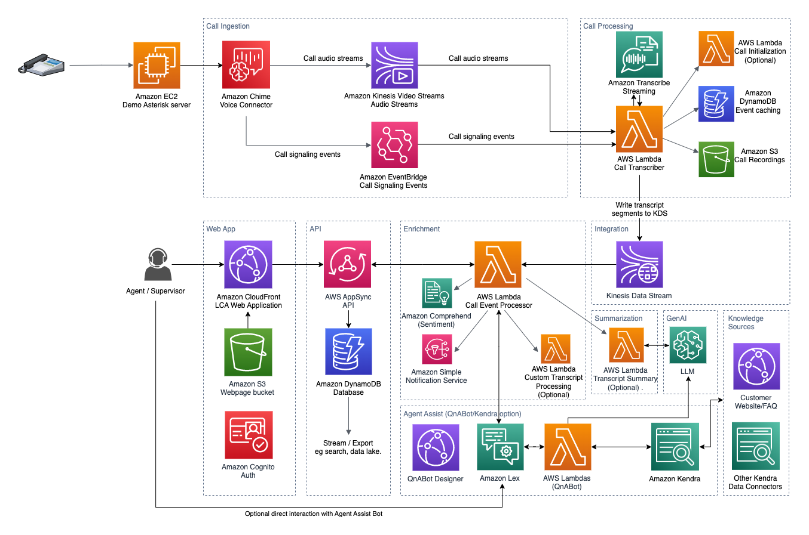
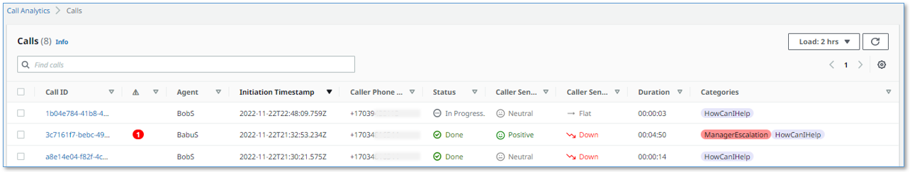

# Amazon Transcribe Live Call Analytics (LCA) with Agent Assist Sample Solution
*Companion AWS blog post: [Live call analytics and agent assist for your contact center with Amazon language AI services](http://www.amazon.com/live-call-analytics)*
## Overview

*Update September 2022 (v0.6.0) – Now supports real-time Detected Issues, real-time Call Categories, real-time Supervisor Alerts and integration with the companion Post Call Analytics (PCA) solution, using the new Amazon Transcribe Real-time Call Analytics service.*  
*See [CHANGELOG](./CHANGELOG.md) for latest features and fixes.*

Your contact center connects your business to your community, enabling customers to order products, callers to request support, clients to make appointments, and much more. When calls go well, callers retain a positive image of your brand, and are likely to return and recommend you to others. And the converse, of course, is also true.

Naturally, you want to do what you can to ensure that your callers have a good experience. There are two aspects to this:

- **Help supervisors assess the quality of your caller’s experiences in real time** – For example, your supervisors need to know if initially unhappy callers become happier as the call progresses. And if not, why? What actions can be taken, before the call ends, to assist the agent to improve the customer experience for calls that aren’t going well?
- **Help agents optimize the quality of your caller’s experiences** – For example, can you deploy live call transcription or AI powered Agent Assistance? This removes the need for your agents to take notes, and provides them with contextually relevant information and guidance during calls, freeing them to focus more attention on providing positive customer interactions.

Amazon machine learning services like Amazon Transcribe and Amazon Comprehend provide feature-rich APIs that you can use to transcribe and extract insights from your contact center audio at scale. Amazon Lex provides conversational AI capabilities that can capture intents and context from conversations, and Amazon Kendra offers intelligent search features that can provide useful information to agents based on callers' needs. Although you could build your own custom call analytics solution using these services, that requires time and resources. You figure that someone must have done this before, and that with luck you’ll find a solution that you can re-use.

Contact Lens for Amazon Connect provides real-time supervisor and agent assist features that could be just what you need, but you may not yet be using Amazon Connect. You need a solution that will also work with your existing contact center.

Our sample solution, Live Call Analytics with Agent Assist (LCA), does most of the heavy lifting associated with providing an end-to-end solution that can plug into your contact center and provide the intelligent insights that you need.

## Architecture
  
  
The demo Asterisk server is configured to use Amazon Voice Connector, which provides the phone number and SIP trunking needed to route inbound and outbound calls. When you configure LCA to integrate with your contact center using the Chime Voice Connector (SIPREC) option, instead of the demo Asterisk server, Voice Connector is configured to integrate instead with your existing contact center using SIP-based media recording (SIPREC) or network-based recording (NBR). In both cases, Voice Connector streams audio to Kinesis Video Streams using two streams per call, one for the caller and one for the agent.  
  
LCA also now also supports two additional input sources, using different architectures for ingestion: 
- The Genesys Cloud AudioHook integration option - see [Genesys AudioHook Integration README](/lca-genesys-audiohook-stack/README.md) for details.
- The new Connect Contact Lens integration option - see [Amazon Connect Integration README](/lca-connect-integration-stack/README.md) for details.
  
When a new caller or agent Kinesis Video stream is initiated, an event is fired using EventBridge. This event triggers the Call Transcriber Lambda function. When both the caller and agent streams have been established, your custom call initialization Lambda hook function, if specified, is invoked for you - see [LambdaHookFunction](./lca-chimevc-stack/LambdaHookFunction.md). Then the Call Transcriber function starts consuming real time audio fragments from both input streams and combines them to create a new stereo audio stream. The stereo audio is streamed to an Amazon Transcribe Real-time Call Analytics or standard Amazon Transribe session (depending on stack parameter value), and the transcription results are written in real time to Kinesis Data Streams.

Each call processing session runs until the call ends. Any session that lasts longer than the maximum duration of an AWS Lambda function invocation (15 minutes) is automatically and seamlessly transitioned to a new ‘chained’ invocation of the same function, while maintaining a continuous transcription session with Amazon Transcribe. This function chaining repeats as needed until the call ends. At the end of the call the function creates a stereo recording file in Amazon S3.

Another Lambda function, the Call Event Processor, fed by Kinesis Data Streams, processes and enriches call metadata and transcription segments. The Call Event Processor integrates with the (optional) Agent Assist services. By default, LCA agent assist is powered by Amazon Lex and Amazon Kendra using the open source QnABot on AWS solution, though other options are available as discussed in the [blog post](http://www.amazon.com/live-call-analytics).  
  
The Call Event Processor function interfaces with AWS AppSync to persist changes (mutations) in DynamoDB and to send real-time updates to logged in web clients.

The LCA web UI assets are hosted on Amazon S3 and served via Amazon CloudFront. Authentication is provided by Amazon Cognito. In demo mode, user identities are configured in an Amazon Cognito user pool. In a production setting, you would likely configure Amazon Cognito to integrate with your existing identity provider (IdP) so authorized users can log in with their corporate credentials.

When the user is authenticated, the web application establishes a secure GraphQL connection to the AWS AppSync API, and subscribes to receive real-time events such as new calls and call status changes for the calls list page, and new or updated transcription segments, agent assist messages, and computed analytics for the call details page.

The entire processing flow, from ingested speech to live webpage updates, is event driven, and so the end-to-end latency is small—typically just a few seconds.


## Deployment instructions
### (optional) Build and Publish LCA CloudFormation artifacts
_Note: Perform this step only if you want to create deployment artifacts in your own account. Otherwise, we have hosted a CloudFormation template for 1-click deployment in the [deploy](#deploy) section_.

*Pre-requisite*: You must already have the [AWS CLI](https://docs.aws.amazon.com/cli/latest/userguide/cli-chap-install.html) and the [AWS SAM CLI](https://docs.aws.amazon.com/serverless-application-model/latest/developerguide/serverless-sam-cli-install.html) (version 1.49 or higher) installed and configured. You can use an AWS Cloud9 environment.

Use the [publish.sh](./publish.sh) bash script to build the project and deploy CloudFormation templates to your own deployment bucket.

Run the script with up to 4 parameters:
```
./publish.sh <cfn_bucket_basename> <cfn_prefix> <region> [public]

- <cfn_bucket_basename>: basename name of S3 bucket to deploy CloudFormation templates and code artifacts. Actual bucketname is determined by appending region to bucket basename. If bucket does not exist it will be created.
- <cfn_prefix>: artifacts will be copied to the path specified by this prefix (path/to/artifacts/)
- <region>: aws region to use for building and deploying artifacts.. artifacts must be installed in this same region. We have currently tested LCA deployments only in Northern Virgina (us-east-1) and Oregon (us-west-2).
- public: (optional) Adding the argument "public" will set public-read acl on all published artifacts, for sharing with any account.
```

It downloads package dependencies, builds code zipfiles, replaces local filesystem references in CloudFormation templates, and copies templates and zip files to the cfn_bucket.
When complete, it displays the URLS for the CloudFormation templates, 1-click URLs for launching the stack create in CloudFormation, and CLI deployment command , e.g.:
```
Outputs
Template URL: https://s3.us-east-1.amazonaws.com/bobs-lca-artifacts-us-east-1/LCA-public/0.1.0/lca-main.yaml
CF Launch URL: https://us-east-1.console.aws.amazon.com/cloudformation/home?region=us-east-1#/stacks/create/review?templateURL=https://s3.us-east-1.amazonaws.com/bobs-lca-artifacts-us-east-1/LCA-public/0.1.0/lca-main.yaml&stackName=LiveCallAnalytics&param_installDemoAsteriskServer=true
CLI Deploy: aws cloudformation deploy --region us-east-1 --template-file /tmp/lca/lca-main.yaml --capabilities CAPABILITY_NAMED_IAM CAPABILITY_AUTO_EXPAND --stack-name LiveCallAnalytics --parameter-overrides AdminEmail='jdoe@example.com' installDemoAsteriskServer=true
```

### Deploy a new stack

Start your LCA experience by using AWS CloudFormation to deploy the sample solution with the built-in demo mode enabled.

The demo mode downloads, builds, and installs a small virtual PBX server on an Amazon EC2 instance in your AWS account (using the free open source [Asterisk](https://www.asterisk.org/get-started/) project) so you can make test phone calls right away and see the solution in action. You can integrate it with your contact center later after evaluating the solution's functionality for your unique use case.

To get LCA up and running in your own AWS account, follow these steps (if you do not have an AWS account, please see [How do I create and activate a new Amazon Web Services account?](https://aws.amazon.com/premiumsupport/knowledge-center/create-and-activate-aws-account/)):

1. Log into the [AWS console](https://console.aws.amazon.com/) if you are not already.
*Note: If you are logged in as an IAM user, ensure your account has permissions to create and manage the necessary resources and components for this application.*
2. Choose one of the **Launch Stack** buttons below for your desired AWS region to open the AWS CloudFormation console and create a new stack. AWS Full-Stack Template is supported in the following regions:

Region name | Region code | Launch
--- | --- | ---
US East (N. Virginia) | us-east-1 | [](https://us-east-1.console.aws.amazon.com/cloudformation/home?region=us-east-1#/stacks/create/review?templateURL=https://s3.us-east-1.amazonaws.com/aws-ml-blog-us-east-1/artifacts/lca/lca-main.yaml&stackName=LCA&param_installDemoAsteriskServer=true)
US West (Oregon) |	us-west-2 | [](https://us-west-2.console.aws.amazon.com/cloudformation/home?region=us-west-2#/stacks/create/review?templateURL=https://s3.us-west-2.amazonaws.com/aws-ml-blog-us-west-2/artifacts/lca/lca-main.yaml&stackName=LCA&param_installDemoAsteriskServer=true)

3. On the CloudFormation `Create Stack` page, click `Next`
4. Enter the following parameters:
    1. `Stack Name`: Name your stack, e.g. LCA  
    **Web UI Authentication**
    2. `Admin Email Address` - Enter the email address of the admin user to be used to log into the web UI. An initial temporary password will be automatically sent via email. This email also includes the link to the web UI
    3. `Authorized Account Email Domain` - (Optional) Enter the email domain that is allowed to signup and signin using the web UI. Leave blank to disable signups via the web UI (users must be created using Cognito). If you configure a domain, **only** email addresses from that domain will be allowed to signup and signin via the web UI  
    **Telephony Ingestion Options**  
    4. `Call Audio Source` - Choose `Demo Asterisk PBX Server` to automatically install a demo Asterisk server for testing Chime Voice Connector streaming
    5. `Allowed CIDR Block for Demo Softphone` - Ignored if `Call Audio Source` is not set to `Demo Asterisk PBX Server`. CIDR block allowed by demo Asterisk server for soft phone registration. Example: '10.1.1.0/24'
    6. `Allowed CIDR List for SIPREC Integration` - Ignored if `Call Audio Source ` is not set to `Demo Asterisk PBX Server`. Comma delimited list of CIDR blocks allowed by Chime Voice Connector for SIPREC source hosts. Example: '10.1.1.0/24, 10.1.2.0/24'
    7. `Lambda Hook Function ARN for SIPREC Call Initialization (existing)` - Used only when CallAudioSource is set to 'Chime Voice Connector (SIPREC)' or 'Demo Asterisk PBX Server'. If present, the specified Lambda function can selectively choose calls to process or to suspend, toggle agent/caller streams, assign AgentId, and/or modify values for CallId and displayed phone numbers. See [LambdaHookFunction.md](./lca-chimevc-stack/LambdaHookFunction.md).
    7. `Amazon Connect instance ARN (existing)` - Ignored if `Call Audio Source ` is not set to `Amazon Connect Contact Lens`. Amazon Connect instance ARN of working instance. Prerequisite: Agent queue and Real Time Contact Lens must be enabled - see [Amazon Connect Integration README](/lca-connect-integration-stack/README.md).  
    **Agent Assist Options**  
    8. `Enable Agent Assist` - Choose `QnABot on AWS with new Kendra Index (Developer Edition)` to automatically install all the components and demo configuration needed to experiment with the new Agent Assist capabilities of LCA. See [Agent Assist README](/lca-agentassist-setup-stack/README.md). If you want to integrate LCA with your own agent assist bots or knowledge bases using either Amazon Lex or your own custom implementations, choose `Bring your own LexV2 bot` or `Bring your own AWS Lambda function`. Or choose `Disable` if you do not want any agent assistant capabilities.
    9. `Agent Assist Kendra IndexId (existing)`, `Agent Assist LexV2 BotId (existing)`, `Agent Assist LexV2 Bot AliasId (existing)`, and `Agent Assist Lambda Function ARN (existing)` - empty by default, but must be populated as described depending on the option chosen for `Enable Agent Assist`.  
    **Amazon S3 Configuration**  
    10. `Call Audio Recordings Bucket Name` - (Optional) Existing bucket where call recording files will be stored. Leave blank to automatically create new bucket
    11. `Audio File Prefix` - The Amazon S3 prefix where the audio files will be saved (must end in "/")
    12. `Call Analytics Output File Prefix` - The Amazon S3 prefix where the post-call analytics files will be saved, when using analytics api mode (must end in "/")  
    **Amazon Transcribe Configuration**  
    13. `Enable Partial Transcripts` - Enable partial transcripts to receive low latency evolving transcriptions for each conversation turn. 
    14. `Transcribe API mode` - Set the default API mode for Transcribe. Set to 'analytics' to use the Amazon Transcribe Real-time Call Analytics service, used to support call categories and alerts, call summarization, and PCA integration.
    15. `Enable Content Redaction for Transcripts` - Enable content redaction from Amazon Transcribe transcription output. **NOTE:** Content redaction is only available when using the English language (en-US). This parameter is ignored when not using the English language
    16. `Language for Transcription` - Language code to be used for Amazon Transcribe
    17. `Content Redaction Type for Transcription` - Type of content redaction from Amazon Transcribe transcription output
    18. `Transcription PII Redaction Entity Types` - Select the PII entity types you want to identify or redact. Remove the values that you don't want to redact from the default. *DO NOT ADD CUSTOM VALUES HERE*.
    19. `Transcription Custom Vocabulary Name` - The name of the vocabulary to use when processing the transcription job. Leave blank if no custom vocabulary to be used. If yes, the custom vocabulary must pre-exist in your account.
    20. `Transcription Custom Language Model Name` - The name of the custom language model to use when processing the transcription job. Leave blank if no custom language model is to be used. If specified, the custom language model must pre-exist in your account, match the Language Code selected above, and use the 'Narrow Band' base model.  
    **Transcript Event Processing Configuration**  
    21. `Enable Sentiment Analysis` - Enable or disable display of sentiment analysis.
    22. `Lambda Hook Function ARN for Custom Transcript Segment Processing (existing)` - If present, the specified Lambda function is invoked by the LCA Call Event Processor Lambda function for each 
      transcript segment. See [TranscriptLambdaHookFunction.md](./lca-ai-stack/TranscriptLambdaHookFunction.md).
    23. `Lambda Hook Function Mode Non-Partial only` - Specifies if Transcript Lambda Hook Function (if specified) is invoked for Non-Partial transcript segments only (true), or for both Partial and Non-Partial transcript segments (false).  
    **Download locations**  
    24. `Demo Asterisk Download URL` - (Optional) URL used to download the Asterisk PBX software
    25. `Demo Asterisk Agent Audio URL` - (Optional)
    URL for audio (agent.wav) file download for demo Asterisk server. Audio file is automatically played when an agent is not connected with a softphone  
    **Amazon CloudFront Configuration**  
    26. `CloudFront Price Class` - The CloudFront price class. See the [CloudFront Pricing](https://aws.amazon.com/cloudfront/pricing/) for a description of each price class.
    27. `CloudFront Allowed Geographies` - (Optional) Comma separated list of two letter country codes (uppercase ISO 3166-1) that are allowed to access the web user interface via CloudFront. For example: US,CA. Leave empty if you do not want geo restrictions to be applied. For details, see: [Restricting the Geographic Distribution of your Content](https://docs.aws.amazon.com/AmazonCloudFront/latest/DeveloperGuide/georestrictions.html).  
    **Record retention**  
    28. `Record Expiration In Days` - The length of time, in days, that LCA will retain call records. Records and transcripts that are older than this number of days are permanently deleted.  
    **User Experience**  
    29. `Category Alert Regular Expression` - If using the 'analytics' Transcribe API Mode, this regular expression will be used to show an alert in red in the web user interface if it matches a call category. This defaults to matching all categories.  
    **Post Call Analytics (PCA) Integration**  
    30. `PCA InputBucket` - (Optional) Value of PCA stack "InputBucket". Effective if Transcribe API Mode parameter is 'analytics'.
    31. `PCA InputBucket Transcript prefix` - Value of PCA stack "InputBucketTranscriptPrefix".
    32. `PCA InputBucket Playback AudioFile prefix` - Value of PCA stack "InputBucketPlaybackAudioPrefix".
    33. `PcaWebAppURL` - (Optional) Value of PCA stack "WebAppURL" - allows PCA UI to be launched from LCA UI.
    34. `PCA Web App Call Path Prefix` - PCA path prefix for call detail pages.
5. After reviewing, check the blue box for creating IAM resources.
6. Choose **Create stack**.  This will take ~15 minutes to complete.
7. Once the CloudFormation deployment is complete,
    1. The admin user will receive a temporary password and the link to the CloudFront URL of the web UI (this can take a few minutes). The output of the CloudFormation stack creation will also provide a CloudFront URL (in the **Outputs** table of the stack details page). Click the link or copy and paste the CloudFront URL into your browser. **NOTE:** this page may not be available while the stack is completing the deployment
    2. You can sign into your application using the admin email address as the username and the temporary password you received via email. The web UI will prompt you to provide your permanent password. The user registration/login experience is run in your AWS account, and the supplied credentials are stored in Amazon Cognito. *Note: given that this is a demo application, we highly suggest that you do not use an email and password combination that you use for other purposes (such as an AWS account, email, or e-commerce site).*.
    3. Once you provide your credentials, you will be prompted to verify the email address. You can verify your account at a later time by clicking the Skip link. Otherwise, you will receive a verification code at the email address you provided (this can take a few minutes). Upon entering this verification code in the web UI, you will be signed into the application.

### Update an existing stack

1. Log into the [AWS console](https://console.aws.amazon.com/) if you are not already.
*Note: If you are logged in as an IAM user, ensure your account has permissions to create and manage the necessary resources and components for this application.*
2. Select your existing LiveCallAnaytics stack
3. Choose **Update**
4. Choose **Replace current template**
5. Use one of the **published template** below for your region, or use the **Template URL** output of the publish.sh script if you have build your own artifacts from the repository:

Region name | Region code | Template URL
--- | --- | ---
US East (N. Virginia) | us-east-1 | https://s3.us-east-1.amazonaws.com/aws-ml-blog-us-east-1/artifacts/lca/lca-main.yaml
US West (Oregon) |	us-west-2 | https://s3.us-west-2.amazonaws.com/aws-ml-blog-us-west-2/artifacts/lca/lca-main.yaml

6. Choose **Next** and review the stack parameters. 
7. Chose **Next** two more times.
8. Check the blue boxes for creating IAM resources, and choose **Update stack** to start the update.

## Categories and Alerts
LCA now supports real-time Categories and Alerts using the new Amazon Transcribe Real-time Call Analytics service.  Use the Amazon Transcribe Category Management console to create one or more categories with *Category Type* set to **REAL_TIME** (see [Creating Categories](https://docs.aws.amazon.com/transcribe/latest/dg/call-analytics-create-categories.html)). As categories are matched by Transcribe Real-time Call Analytics during the progress of a call, they are dynamically identified by LCA in the live transcript, call summary, and call list areas of the UI.

Categories with names that match the LCA CloudFormation stack parameter “*Category Alert Regular Expression*” are highlighted with a red color to show that they have been designated by LCA as *Alerts*. The Alert counter in the Call list page is used to identify, sort, and filter calls with alerts, allowing supervisors to quickly identify potentially problematic calls, even while they are still in progress.

LCA publishes a notification for each matched category to a topic in the Amazon Simple Notification Service. Subscribe to this topic to receive emails, SMS text messages, or to integrate category match notifications with your own applications. For more information, see [Configure SNS Notifications on Call Categories](./lca-ai-stack/Notifications.md).
  
## Testing
You can test this solution if you installed the demo asterisk server during deployment. To test, perform the following steps:
1. Configure a Zoiper client as described in this [README](lca-chimevc-stack/README.md). This will allow you to receive phone calls from an external phone number to the Zoiper client on your computer.
2. Once installed, log in to the web app created in the [deploy](#deploy) section by opening the Cloudfront URL provided in you CloudFormation outputs (`CloudfrontEndpoint`)
3. Once logged in, place a phone call using an external phone to the number provided in the CloudFormation outputs (`DemoPBXPhoneNumber`)
4. You will see the phone call show up on the LCA web page as follows 
5. Try the built-in agent assist demo using the [agent assist demo script](lca-agentassist-setup-stack/agent-assist-demo-script.md). For more detail and tutorials on Agent Assist, see [Agent Assist README](lca-agentassist-setup-stack/README.md)

## Additional Customization options
- [SIPREC Call Initialization Lambda Hook](./lca-chimevc-stack/LambdaHookFunction.md)
- [Delay start of call processing](./lca-chimevc-stack/StartCallProcessingEvent.md)
- [Assign an AgentID to a call](./lca-chimevc-stack/SettingAgentId.md)
- [Customize transcript processing](./lca-ai-stack/TranscriptLambdaHookFunction.md)

## Post Call Analytics: Companion solution
Our companion solution, Post Call Analytics (PCA), offers additional insights and analytics capabilities by using the Amazon Transcribe Call Analytics batch API to detect common issues, interruptions, silences, speaker loudness, call categories, and more. Unlike LCA, which transcribes and analyzes streaming audio in real time, PCA analyzes your calls after the call has ended. The new Amazon Transcribe Real-time Call Analytics service provides post-call analytics output from your streaming sessions just a few minutes after the call has ended. LCA can now send this post-call analytics data to the latest version of PCA to provide analytics visualizations for your streaming sessions without needing to transcribe the audio a second time. Configure LCA to integrate with the latest version of PCA using the LCA CloudFormation tempate parameters labeled Post Call Analytics (PCA) Integration. Use the two solutions together to get the best of both worlds. For more information, see [Post call analytics for your contact center with Amazon language AI services](www.amazon.com/post-call-analytics).

## Conclusion
The Live Call Analytics (LCA) with Agent Assist sample solution offers a scalable, cost-effective approach to provide live call analysis with features to assist supervisors and agents to improve focus on your callers’ experience. It uses Amazon ML services like Amazon Transcribe, Amazon Comprehend, Amazon Lex and Amazon Kendra to transcribe and extract real-time insights from your contact center audio.
The sample LCA application is provided as open source—use it as a starting point for your own solution, and help us make it better by contributing back fixes and features via GitHub pull requests. For expert assistance, [AWS Professional Services](https://aws.amazon.com/professional-services/) and other [AWS Partners](https://aws.amazon.com/partners/) are here to help.

## Clean Up
Congratulations! :tada: You have completed all the steps for setting up your live call analytics sample solution using AWS services.

**To make sure you are not charged for any unwanted services, you can clean up by deleting the stack created in the _Deploy_ section and its resources.**

When you’re finished experimenting with this sample solution, clean up your resources by using the AWS CloudFormation console to delete the LiveCallAnalytics stacks that you deployed. This deletes resources that were created by deploying the solution. The recording S3 buckets, the DynamoDB table and CloudWatch Log groups are retained after the stack is deleted to avoid deleting your data.

[(Back to top)](#overview)

## Contributing
Your contributions are always welcome! Please have a look at the [contribution guidelines](CONTRIBUTING.md) first. :tada:

[(Back to top)](#overview)

## Security

See [CONTRIBUTING](CONTRIBUTING.md#security-issue-notifications) for more information.

[(Back to top)](#overview)


## License Summary

This sample code is made available under the Apache-2.0 license. See the [LICENSE](LICENSE.txt) file.

[(Back to top)](#overview)
