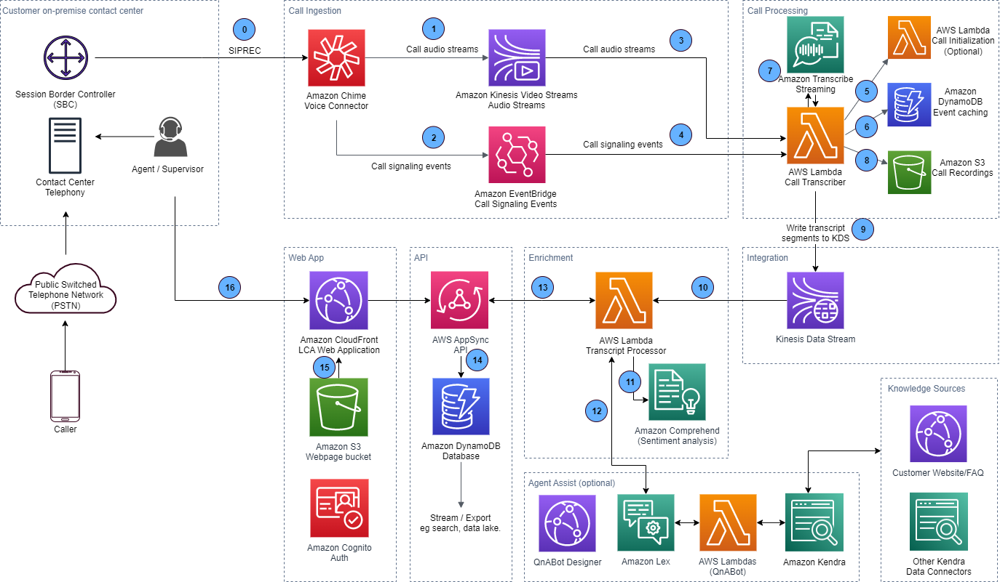

# **AWS Live Call Analytics Security**

## **Summary**

This document provides a compiled list of security controls and best practices for the AWS [Live Call Analytics](https://amazon.com/live-call-analytics) (LCA) solution.

## **Solution Overview**

LCA is an open source solution used to transcribe and analyze contact center calls in real-time. It helps contact center supervisors and agents to improve callers' experience, boost agent productivity, and gain conversation insights by adding artificial intelligence (AI) capabilities to the contact center.

LCA is distributed as a fully packaged and secure solution that can be deployed in your AWS account using AWS CloudFormation. The solution does most of the heavy lifting associated with providing an end-to-end system that can plug into your contact center and provide insights in real-time. This includes components to ingest call audio, perform streaming transcriptions, enrich transcriptions with machine learning (e.g. sentiment analytics) and create call recording. The solution provides an interface via a web application and an API.

The LCA solution is published in a public GitHub [repository](https://github.com/aws-samples/amazon-transcribe-live-call-analytics) which allows you to review the code and infrastructure configuration that is deployed in your AWS account. The diagram below shows the main architectural components and how they fit together at a high level. Numbered connections depict communication between services used in the architecture.

## **Controls and Options**

The table below describes the security controls implemented by the LCA solution. The LCA solution is designed with security best practices in mind. However, the security of its implementation can differ based on your specific use case and adding additional security measures can have additional costs. In addition to the security controls included out of the box, the following table also describes options to enhance the security posture of LCA in production environments.

| **Security Need**                          | **Controls and Options**                                                                                                                                                                                                                                                                                                                                                                                                                                                                                                                                                                                                                                                                                                                                                                                                                                                                                                                                                                                                                                                                                                                                                                                                                                                                                                                                                                                                                                                                                                                                                                                                                                                                                                                                                                                                                                                                                                                                                                                                                                                                                                                                                                                                                                                                                                                                                                                                                                                                                                                                                                                                                                                                                                                                                                                                                                                                                                                                                                                                                                                                                                                                                                                        |
| :----------------------------------------- | :-------------------------------------------------------------------------------------------------------------------------------------------------------------------------------------------------------------------------------------------------------------------------------------------------------------------------------------------------------------------------------------------------------------------------------------------------------------------------------------------------------------------------------------------------------------------------------------------------------------------------------------------------------------------------------------------------------------------------------------------------------------------------------------------------------------------------------------------------------------------------------------------------------------------------------------------------------------------------------------------------------------------------------------------------------------------------------------------------------------------------------------------------------------------------------------------------------------------------------------------------------------------------------------------------------------------------------------------------------------------------------------------------------------------------------------------------------------------------------------------------------------------------------------------------------------------------------------------------------------------------------------------------------------------------------------------------------------------------------------------------------------------------------------------------------------------------------------------------------------------------------------------------------------------------------------------------------------------------------------------------------------------------------------------------------------------------------------------------------------------------------------------------------------------------------------------------------------------------------------------------------------------------------------------------------------------------------------------------------------------------------------------------------------------------------------------------------------------------------------------------------------------------------------------------------------------------------------------------------------------------------------------------------------------------------------------------------------------------------------------------------------------------------------------------------------------------------------------------------------------------------------------------------------------------------------------------------------------------------------------------------------------------------------------------------------------------------------------------------------------------------------------------------------------------------------------------------------- |
| Network Access Control & Isolation         | 
**Call Ingestion (0)**

The LCA solution uses AmazonAmazon Chime SDK Voice Connector to ingest phone call audio from your on-premises Private Branch Exchanges (PBXs) and Session Border Controllers (SBCs) using the SIPREC protocol.

AmazonAmazon Chime SDK Voice Connector is a regional managed service (currently in the us-east-1 and us-west-2 regions). When you deploy it in your AWS account, it creates an endpoint with a unique hostname that is accessible over the public Internet. Your SBC or telephony systems are configured to establish a SIPREC trunk that sends a copy of your contact center calls to this endpoint.

Configuration Options:

The AmazonAmazon Chime SDK Voice Connector endpoint supports TLS to encrypt the SIPREC signaling and SRTP to encrypt media streams. It is strongly recommended to use encryption with yourAmazon Chime SDK Voice Connector endpoint. When you configure it to use TLS and SRTP encryption, the endpoint rejects unencrypted connections. You can configure an allow-list to only permit connections from your IP addresses. The destination IP address ranges and ports are documented in the AmazonAmazon Chime SDK Voice Connector [Network configuration page](https://docs.aws.amazon.com/chime/latest/ag/network-config.html#cvc).

**User Interface and API (16)**

Agents and supervisors from your contact center can connect to a web application to view details of calls completed or in-progress. The web application is downloaded from an Amazon CloudFront distribution created in your account. The web application uses a GraphQL API provided by the AWS AppSync service. The web application provides links to audio recordings from an Amazon S3 bucket in your account.

The hostnames of the CloudFront distribution, AppSync API and the recording S3 bucket are unique to your AWS account. You can enable access to those specific hostnames from the agent’s/supervisor’s machines.

Configuration Options:

Amazon CloudFront can restrict access to specific geographical regions. Additionally, for the Amazon CloudFront web distribution and/or AWS AppSync API, you can use AWS WAF to protect against attacks and restrict access by IP addresses. Access to the S3 recording bucket can be restricted to your IP addresses using a bucket policy. See:

[Use CloudFront geo restriction to restrict access from geographic regions](https://aws.amazon.com/premiumsupport/knowledge-center/cloudfront-geo-restriction/) and [Limit Amazon S3 bucket access to certain IPs or VPCs](https://aws.amazon.com/premiumsupport/knowledge-center/block-s3-traffic-vpc-ip/)

You can also use custom hostnames for the web app URL distributed via Amazon CloudFront and the Amazon API if you prefer using your own DNS domains. See: [Using custom URLs by adding alternate domain names ](https://docs.aws.amazon.com/AmazonCloudFront/latest/DeveloperGuide/CNAMEs.html)and [Configuring custom domain names](https://docs.aws.amazon.com/appsync/latest/devguide/custom-domain-name.html).

 |
| 
Inter-network traffic

privacy
 | 
The LCA solution use integrations between AWS Services. 

AWS services operate in secure segregated networks accessed only via defined service endpoints over HTTPS/port 443, and enforce encryption, authentication, and authorization policies. 

For information on IP ranges by service, see: [ aws ip ranges](https://docs.aws.amazon.com/general/latest/gr/aws-ip-ranges.html).

For information on security and compliance of AWS infrastructure, see:

- [AWS Infrastructure Security](https://docs.aws.amazon.com/whitepapers/latest/introduction-aws-security/security-of-the-aws-infrastructure.html) 

- [Security documentation by service](https://docs.aws.amazon.com/security/?secd_intro2) – eg: [DynamboDB](https://docs.aws.amazon.com/amazondynamodb/latest/developerguide/security.html)  

Inter-service communications used by the LCA solution are indicated and numbered on the LCA architecture diagram above. In each case, connections between services, including connections to data storage services - Amazon DynamoDB (6,14), Amazon S3 (8,15), Amazon Kinesis (1,2,9,10) - are routed within the Amazon managed network infrastructure to the associated service endpoint which allows access to the target service only if the requests are encrypted using TLS with ephemeral keys associated with valid IAM roles and policies (See Identity and Access Management below). 

                                                                                                                                                                                                                                                                                                                                                                                                                                                                                                                                                                                                                                                                                                                                                                                                                                                                                                                                                                                                                                                                                                                                                                                                                                                                                                                                                                                                                                                                                                                                                                                                                                                                                                                                                  |
| Encryption of data in-transit              | 
Data transmitted over networks is encrypted to help secure your data from eavesdropping and man-in-the-middle attacks. This includes the following components and services:

- The AmazonAmazon Chime SDK Voice Connector endpoint supports TLS to encrypt the SIPREC signaling and SRTP to encrypt media streams

- The LCA web application enforces the use of TLS including: CloudFront distribution automatically redirects unencrypted connections to HTTPS. The AppSync API only supports TLS endpoints. The S3 buckets have a bucket policy to enforce access only via TLS

- AWS API calls made from Lambda functions to other services (e.g. Amazon Kinesis Video Streams, Amazon S3, AWS AppSync, Amazon Transcribe, Amazon Comprehend, Amazon DynamoDB) are encrypted using TLS

                                                                                                                                                                                                                                                                                                                                                                                                                                                                                                                                                                                                                                                                                                                                                                                                                                                                                                                                                                                                                                                                                                                                                                                                                                                                                                                                                                                                                                                                                                                                                                                                                                                                                                                                                                                                                                                                                                                                                                                                                                                                                                                                                                                                                                                                                                                                                                                  |
| Encryption of data at-rest                 | 
Data at rest is encrypted to help secure your data from unauthorized access to the underlying storage. This includes the following components and services:

- Amazon S3 buckets provisioned by the LCA solution are configured to use server-side AES-256 encryption. Amazon S3 encrypts your data at the object level as it writes it to disks and decrypts it for you when you access it. See: [Protecting data using server-side encryption](https://docs.aws.amazon.com/AmazonS3/latest/userguide/serv-side-encryption.html)

- Amazon DynamoDB tables provisioned by the LCA solution are configured to use server-side AES-256 encryption with DynamoDB owned keys. See: [DynamoDB Encryption at Rest](https://docs.aws.amazon.com/amazondynamodb/latest/developerguide/EncryptionAtRest.html)

- Amazon CloudWatch log groups use server-side encryption for the log data at rest using Amazon CloudWatch managed keys. See: [Encrypt log data in CloudWatch Logs ](https://docs.aws.amazon.com/AmazonCloudWatch/latest/logs/encrypt-log-data-kms.html)

- Ephemeral storage associated to AWS Lambda compute environments are encrypted using service managed keys

- Integration services used by the LCA solution such as Amazon Amazon Kinesis Video Streams, Amazon Kinesis Data Streams are configured to use encryption at rest with AWS KMS keys managed by AWS. Other integration services such as Amazon EventBridge also use encryption at rest by default

                                                                                                                                                                                                                                                                                                                                                                                                                                                                                                                                                                                                                                                                                                                                                                                                                                                                                                                                                                                                                                                                                                                                                                                                                                                                                                                                                                                                                                                                                                                                                                                                                                                                                     |
| Identity and access management             | 
The AWS services used by the LCA solution use AWS Identity & Access Management (IAM) to manage authentication and authorization.

 The LCA solution implements IAM roles with least privilege policies to provide the minimally required permissions between components. AWS API requests between components are authenticated using temporary credentials and using the AWS [Signature Version 4 signing process](https://docs.aws.amazon.com/general/latest/gr/signature-version-4.html).

The S3 buckets provisioned by the solution are configured with public access blocked to prevent accidental unauthenticated data exposure.

Access to the web application and the AppSync API is secured using an Amazon Cognito user pool. This user pool allows you to create users that are allowed to sign in to the application. After successfully authenticating a user, Amazon Cognito issues JSON web tokens (JWT) that is used to secure and authorize access to the AppSync APIs, or exchange for temporary AWS credentials

Configuration Options:

You can use AWS IAM to manage administrative access to AWS resources services from the AWS Console or via API requests. See: [Security best practices in IAM](https://docs.aws.amazon.com/IAM/latest/UserGuide/best-practices.html).

You can enable multi factor authentication (MFA) in the Amazon Cognito user pool. See: [Adding MFA to a user pool](https://docs.aws.amazon.com/cognito/latest/developerguide/user-pool-settings-mfa.html).

You can use Amazon Cognito to federate with your existing identity providers to provide single sign on (SSO). This includes federation via SAML identity providers. See: [Adding user pool sign-in through a third party. ](https://docs.aws.amazon.com/cognito/latest/developerguide/cognito-user-pools-identity-federation.html)

                                                                                                                                                                                                                                                                                                                                                                                                                                                                                                                                                                                                                                                                                                                                                                                                                                                                                                                                                                                                                                                                                                                                                                                                                                                                         |
| Auditing of API interactions               | 
Administrative API calls of AWS services used by the LCA solution are logged via AWS CloudTrail. AWS CloudTrail logs management events across AWS services by default and is available for free.

The LCA AppSync API uses Amazon CloudWatch to record GraphQL API requests which can be used to audit and monitor application level user interactions.

Configuration Options:

You can log API data events to Amazon S3 and Amazon DynamoDB (at an additional charge). See: [Logging data events for AWS CloudTrail trails](https://docs.aws.amazon.com/awscloudtrail/latest/userguide/logging-data-events-with-cloudtrail.html).

You can also enable access logs for S3 buckets and CloudFront distributions. See: [Enabling Amazon S3 server access logging ](https://docs.aws.amazon.com/AmazonS3/latest/userguide/enable-server-access-logging.html)and [Configuring and using Amazon CloudFront logs](https://docs.aws.amazon.com/AmazonCloudFront/latest/DeveloperGuide/AccessLogs.html)

                                                                                                                                                                                                                                                                                                                                                                                                                                                                                                                                                                                                                                                                                                                                                                                                                                                                                                                                                                                                                                                                                                                                                                                                                                                                                                                                                                                                                                                                                                                                                                                                                                                                                                                                                                                                                                                                                                                                                                                                                                                                                                                                                        |
| Data Lifecyle                              | 
Configuration Options:

You can configure data lifecycle rules to expire data including:

- Amazon S3 buckets. See: [Managing your Amazon S3 storage lifecycle ](https://docs.aws.amazon.com/AmazonS3/latest/userguide/object-lifecycle-mgmt.html)

- Amazon DynamoDB. See: [Amazon DynamoDB Time to Live (TTL)](https://docs.aws.amazon.com/amazondynamodb/latest/developerguide/howitworks-ttl.html)

&emsp;- The LCA solution automates DynamoDB data retention. (a) Event cache records created by the CallTranscriber are automatically deleted after 1 day. (b) Call metadata, transcriptions, and analytic records created by AppSync are retained for the number of days specified by the RetentionDays parameter of the LCA CloudFormation template when the LCA solution is deployed or updated (default 90 days).

- Amazon CloudWatch Logs. See: [Amazon CloudWatch Logs data retention](https://docs.aws.amazon.com/AmazonCloudWatch/latest/logs/Working-with-log-groups-and-streams.html#SettingLogRetention)

                                                                                                                                                                                                                                                                                                                                                                                                                                                                                                                                                                                                                                                                                                                                                                                                                                                                                                                                                                                                                                                                                                                                                                                                                                                                                                                                                                                                                                                                                                                                                                                                                                                                                                                                                                                                                                                                                                                                                                                                                                                                                                                                       |
| Compliance documentation                   | 
For a list of AWS services in scope of specific compliance programs, see AWS Services in [Scope by Compliance Program](https://aws.amazon.com/compliance/services-in-scope/). For general information, see [AWS Compliance Programs](https://aws.amazon.com/compliance/programs/).

You can download third-party audit reports using [AWS Artifact](https://docs.aws.amazon.com/artifact/index.html). For more information, see [Downloading Reports in AWS Artifact](https://docs.aws.amazon.com/artifact/latest/ug/downloading-documents.html).

                                                                                                                                                                                                                                                                                                                                                                                                                                                                                                                                                                                                                                                                                                                                                                                                                                                                                                                                                                                                                                                                                                                                                                                                                                                                                                                                                                                                                                                                                                                                                                                                                                                                                                                                                                                                                                                                                                                                                                                                                                                                                                                                                                                                                                                                                                                                                                                                                                                                                                                                                                                                                                     |
| 
Update/Patch/

hardening
       | 
The LCA solution is based on fully managed and serverless AWS services that do not require customers to configure or maintain a physical or virtual machine. Patches and feature updates are managed by the services and transparent to users. (Exception is an EC2 instance only deployed in demo mode that is used host an Asterisk telephony server).

Software dependencies are monitored using an automated process that identifies known vulnerable dependencies and are updated periodically based on the associated risk.

                                                                                                                                                                                                                                                                                                                                                                                                                                                                                                                                                                                                                                                                                                                                                                                                                                                                                                                                                                                                                                                                                                                                                                                                                                                                                                                                                                                                                                                                                                                                                                                                                                                                                                                                                                                                                                                                                                                                                                                                                                                                                                                                                                                                                                                                                                                                                                                                                                                                                                                                                                                                                                                     |
| Secure development process                 | 
The LCA solution development process includes application security reviews, threat modeling and static code analysis. The solution is scanned for common security issues (e.g. OWASP Top 10) covering the CloudFormation templates, Lambda functions and the web user interface.

The code of the solution is fully open source which allows you to directly review its security posture.

Push access to the GitHub code repository is strictly limited to a small number of AWS employees authorized to release updates to the code.

                                                                                                                                                                                                                                                                                                                                                                                                                                                                                                                                                                                                                                                                                                                                                                                                                                                                                                                                                                                                                                                                                                                                                                                                                                                                                                                                                                                                                                                                                                                                                                                                                                                                                                                                                                                                                                                                                                                                                                                                                                                                                                                                                                                                                                                                                                                                                                                                                                                                                                                                                                                                                                    |

## **Shared Security Model**

Cloud security at AWS is the highest priority. As an AWS customer, you benefit from a data center and network architecture that is built to meet the requirements of the most security-sensitive organizations.

Security is a shared responsibility between AWS and you. The [shared responsibility model](https://aws.amazon.com/compliance/shared-responsibility-model/) describes this as security *of* the cloud and security *in* the cloud:

- **Security of the cloud** – AWS is responsible for protecting the infrastructure that runs AWS services in the AWS Cloud. AWS also provides you with services that you can use securely. The effectiveness of our security is regularly tested and verified by third-party auditors as part of the [AWS compliance programs](https://aws.amazon.com/compliance/programs/). To learn about the compliance programs that apply to AWS services, see [AWS Services in Scope by Compliance Program](https://aws.amazon.com/compliance/services-in-scope/)
- **Security in the cloud** – Your responsibility is determined by the AWS services that you use. You are also responsible for other factors including the sensitivity of your data, your organization’s requirements, and applicable laws and regulations.

For best practices see the [Security, Identity & Compliance](https://aws.amazon.com/architecture/security-identity-compliance/?cards-all.sort-by=item.additionalFields.sortDate&cards-all.sort-order=desc&awsf.content-type=*all&awsf.methodology=*all) section of the AWS Architecture Center. For additional AWS security, compliance, penetration testing, Security Bulletins, resources, etc., please visit the [AWS Cloud Security website](https://aws.amazon.com/security/).

## **Data Privacy**

The LCA solution is deployed in your AWS accounts. As a customer, you maintain ownership of your content, and you select which AWS services can process, store, and host your content. AWS does not access or use your content for any purpose without your agreement. AWS never uses customer content or derive information from it for marketing or advertising. For details, see [AWS Data Privacy](https://aws.amazon.com/compliance/data-privacy-faq/)
