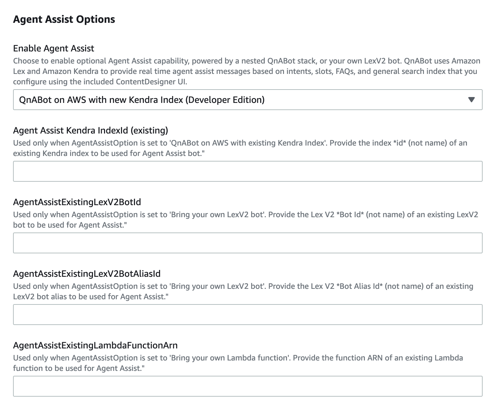
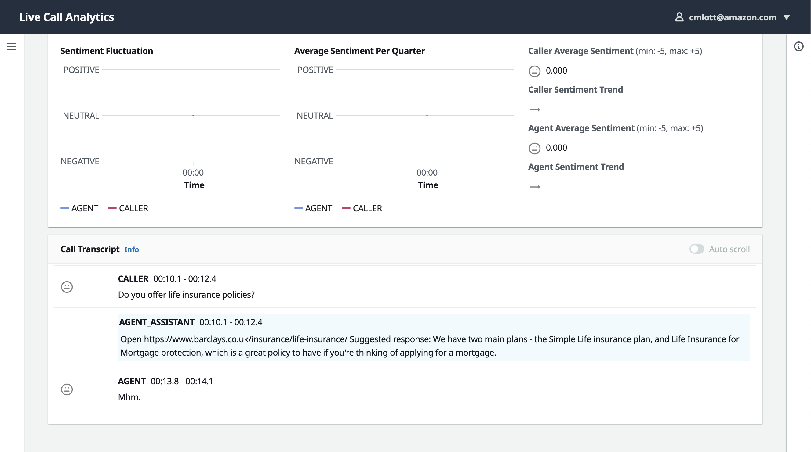
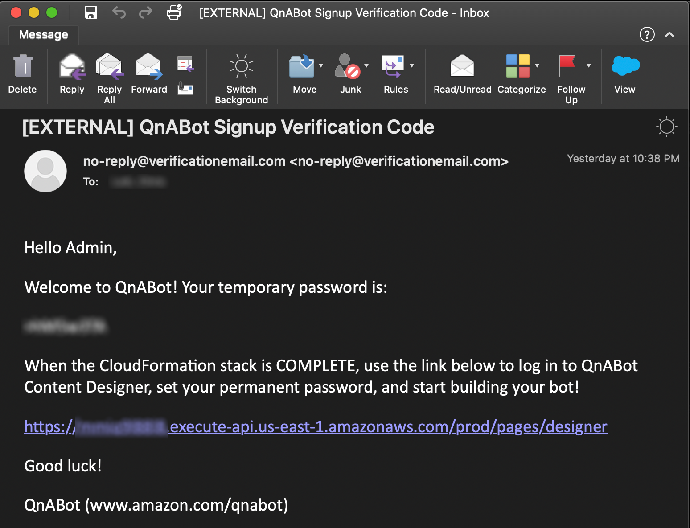
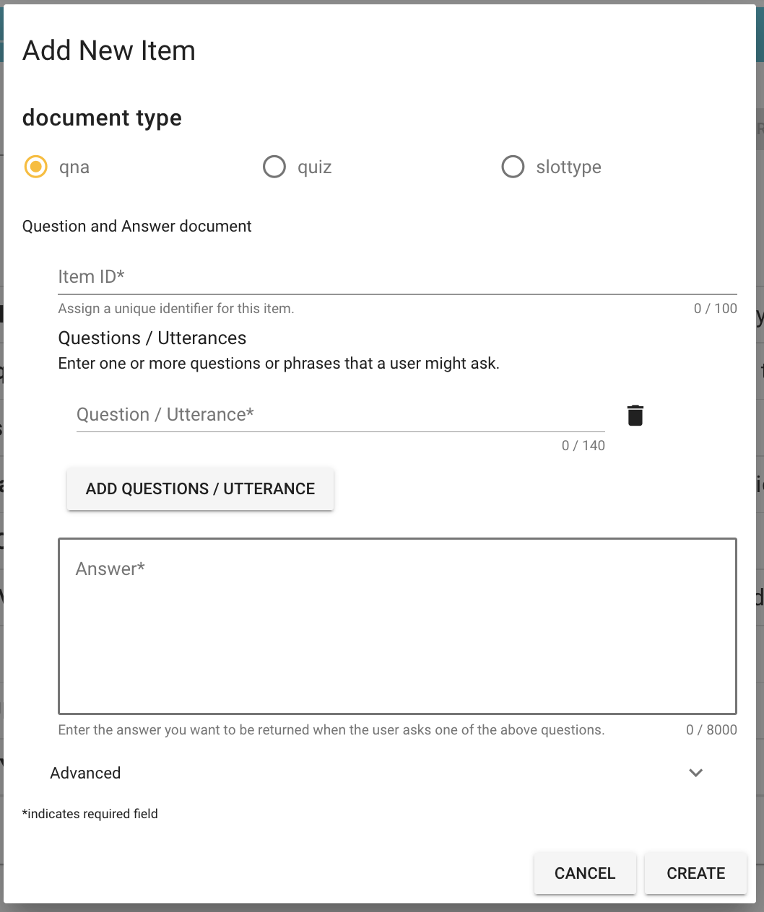
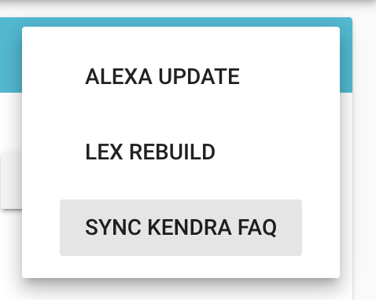
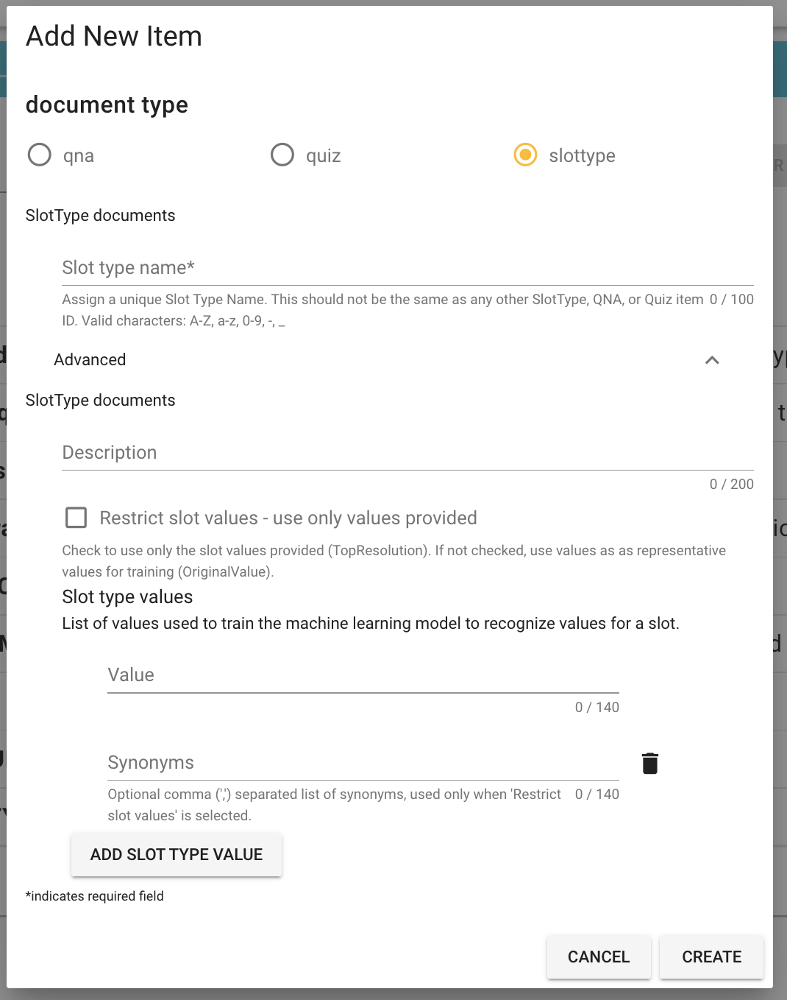
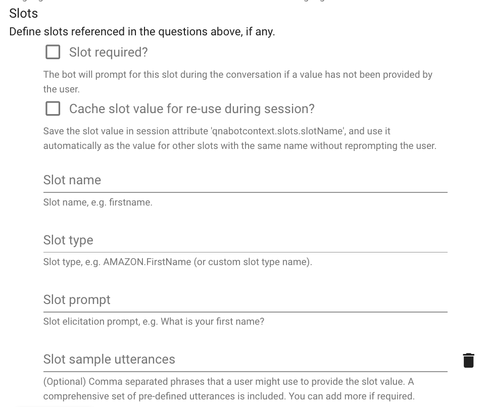
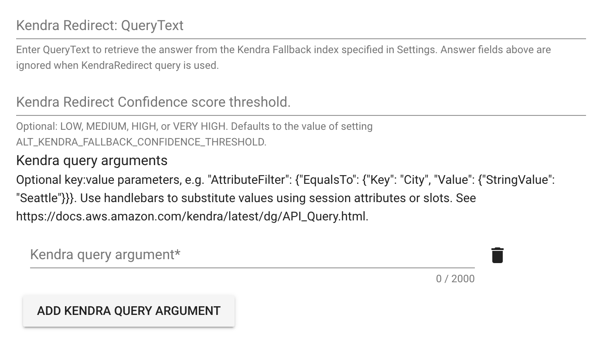
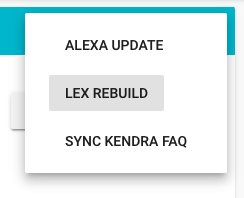

# LCA Agent Assist

## Table of Contents

1. [Introduction to Agent Assist](#introduction)  
  a. [Amazon Lex and Amazon Kendra using QnABot](#amazon-lex-and-amazon-kendra-using-qnabot)  
  b. [Option: Bring your own Lex Bot](#option-bring-your-own-lex-bot)  
  c. [Option: Bring your own Lambda function](#option-bring-your-own-lambda-function)  
2. [How it works](#how-it-works)  
3. [How to enable Agent Assist](#how-to-enable-agent-assist)
4. [Testing Agent Assist](#testing-agent-assist)
5. [Configuring Agent Assist Responses](#configuring-agent-assist-responses)  
  a. [Static FAQ response](#static-faq-response)  
  b. [Dynamic response](#dynamic-response)  
  ... i.  [Context aware response](#context-aware-response)  
  ... ii. [Dynamic Knowledge Base Query](#dynamic-knowledge-base-query)  
  ... iii. [Dynamic Custom Business Logic](#dynamic-custom-business-logic)  
  c. [Amazon Kendra Fallback Response](#amazon-kendra-fallback-response)   
  d. [Rebuild Lex and Sync FAQs to Kendra](#rebuild-lex--sync-faqs-to-kendra)   

## Introduction

Live Call Analytics with Agent Assist is a solution for contact centers, providing in-line messages to help agents respond to callers’ needs.  

Before continuing, please read the blog post [Live call analytics and agent assist for your contact center with Amazon language AI services](https://amazon.com/live-call-analytics), deploy LCA, and follow the tutorial to experience the Agent Assist demo. This is prerequisite context for the rest of this document.


### Amazon Lex and Amazon Kendra using QnABot

The default agent assist configuration works by sending the transcription of a caller’s utterances to a chatbot, powered by Amazon Lex and Amazon Kendra, using the [QnABot on AWS solution](https://aws.amazon.com/solutions/implementations/aws-qnabot/) to simplify configuration and orchestration. Lex tracks the callers intents and can advise the agent to elicit additional information as needed to fulfil an intent, while Kendra is used to query frequently asked questions and knowledge base documents. Bot responses are shown in real time to the agent, along with the transcription of the conversation. It is easily configured to support customized intents, FAQs, and knowledgebase content.

This body of this README describes how to use and customise this default configuration. 

### Option: Bring your own Lex Bot

Alternatively, you can plug-in your own Amazon LexV2 chat bot to provide Agent Assist logic. Choose `Bring your own LexV2 bot` for `Enable Agent Assist` when deploying or updating the LCA stack. Identify your bot using the parameters `AgentAssistExistingLexV2BotId` and `AgentAssistExistingLexV2BotAliasId`

Your bot provide intents, slots, and integration with backend data and knowledge systems as needed to provide contextually appropriate messages that assist the agent as they guide the conversation with the caller. LCA interacts with your bot using the LexV2 RecognizeText API, passing each caller utterance to the bot, and expecting an Agent Assist message in a response. Use slot elicitation prompts, intent confirmation prompts, intent fulfillment messages and more as agent assist messages. If your bot returns an empty message, or no message, in the response, then no agent assist message is displayed for that turn of the conversation. 

### Option: Bring your own Lambda function

A second alternative allows you to implement your own Agent Assist logic using an AWS Lambda function instead of a Lex bot. Choose `Bring your own AWS Lambda function` when deploying or updating the LCA stack. Identify your Lambda function using the parameter `AgentAssistExistingLambdaFunctionArn`.

LCA interacts uses the Lambda Invoke API to synchronously invoke your function (request mode), passing each caller utterance along with additional call metadata in the event payload, and expecting an Agent Assist message in the Lambda response, in the following JSON format. 
```
{
  "message": "<agent assist message>"
}
```
If your function returns an empty message, or no message, in the response, then no agent assist message is displayed for that turn of the conversation.


## How it works

Here is the LCA architecture overview showing how Agent Assist fits into the overall real time processing flow.  
  


The default LCA Agent Assist configuration uses the QnABot on AWS solution (v5.2.0 or later) to handle the architecture deployment and configuration of Amazon Lex and Amazon Kendra. The QnABot provides a single administrative interface, the Content Designer, which is used to create Lex Intents, and Kendra FAQs. 
Learn about QnABot on AWS by reviewing the solution [Landing page](https://aws.amazon.com/solutions/implementations/aws-qnabot/) and [Implementation Guide](https://docs.aws.amazon.com/solutions/latest/qnabot-on-aws/welcome.html). 

QnABot uses **Amazon Lex** to manage conversational requests and reponses. 

Amazon Lex is an AWS service for building conversational interfaces - see [Amazon Lex features](https://aws.amazon.com/lex/features/) to to learn about the key concepts, such as Intents, Utterances, Slots, etc. 

Typically, a Lex bot is used in a contact center to automate a conversation with a caller, where the caller and the bot communicate directly. However, in the Agent Assist scenario we use Lex differently. Here, the caller and the agent communicate directly. The bot 'listens in' but does not directly interact with the caller. Instead, based on what the caller says, the bot provides advice to the agent, to help them guide the conversation. You've already seen this in action in the [LCA blog post tutorial](www.amazon.com/live-call-analytics).

QnABot also uses **Amazon Kendra** as an integrated knowledge base and ML powered intelligent search service that finds the best response to a caller's enquiry from either a list of prepopulated FAQs, or from other 'unstructured' documements such as crawled web pages, word documents, or other sources that have been ingested into a Kendra search index using a Kendra data source connector. See [Amazon Kendra features](https://aws.amazon.com/kendra/features/) to to learn about the key concepts, such as Indexes, FAQs, Connectors, etc.  

Now that you are familiar with the main concepts related to Lex and Kendra, read the following QnABot Implementation Guide chapters to learn how QnABot uses Kendra to answer questions:
 - [Populate the chatbot with your questions and answers](https://docs.aws.amazon.com/solutions/latest/qnabot-on-aws/create-chatbot-content-and-load-sample-qanda-data.html)
 - [Integrate Amazon Kendra](https://docs.aws.amazon.com/solutions/latest/qnabot-on-aws/integrate-amazon-kendra.html)
  
Also read the QnABot Implementation Guide at [Configure intent and slot matching](https://docs.aws.amazon.com/solutions/latest/qnabot-on-aws/intent-and-slot-matching.html) to learn how QnABot (v5.2.0 and later) creates Lex intents and slots directly from the ContentDesigner UI. LCA agent assist uses this feature to identify caller intents and to guide the agent to ask for additional information (slots) when needed. 

Now, recall the example from the [agent assist demo script](lca-agentassist-setup-stack/agent-assist-demo-script.md) that you used already when you installed LCA and followed the tutorial. If a caller says “I’m calling about my card”, but does not specify the type of card, Amazon Lex can identify what the intent is (which is calling about a card), but it still needs more information (the slot value, which is the type of card). In this case, the Agent Assist suggested response would be “What type of card are you interested in? A rewards card or purchase card?”. The caller then can reply with “rewards card”, which will “fulfill” the intent. This means all the required slots have been collected.

## How to enable Agent Assist

By following the tutorial in the [LCA blog post](www.amazon.com/live-call-analytics) you have already installed and configured Agent Assist with the the default option: `QnABot on AWS with new Kendra Index (Developer Edition)`.

Other Agent Assist options can be specified during stack deployment or update by providing values for the **Agent Assist Options** CloudFormation parameters as shown below.



The main parameter to enable Agent Assist is the “**Enable Agent Assist**” parameter. Here is a description of the parameter options:

|Value	|Description	|
|---	|---	|
|Disabled	|Selecting this value will disable Agent Assist	|
|Bring your own LexV2 Bot	|Select this value if you already have a pre-configured LexV2 bot. You must provide LCA with the existing Lex Bot ID and Bot Alias in the **AgentAssistExistingLexV2BotId** and **AgentAssistExistingLexV2BotAliasId,** and an existing Kendra index in the **AgentAssistKendraIndexId** CloudFormation parameters.	|
|QnABot on AWS with existing Kendra Index	|This deploys a new QnABot on AWS with an existing Kendra Index. If you select this value, you are required to provide LCA with an existing Kendra index in the **AgentAssistKendraIndexId** CloudFormation parameters.	|
|QnABot on AWS with new Kendra Index (Developer Edition)	|This deploys a new QnABot on AWS with a new Amazon Kendra  Developer Edition Index	|
|QnABot on AWS with new Kendra Index (Enterprise Edition)	|This deploys a new QnABot on AWS with a new Amazon Kendra Enterprise Edition Index	|
|Bring your own Lambda function	|This will send the customer's speech to a Lambda function. This will allow you to build your own custom Agent Assist integrations, for example, look up responses in a 3rd party knowledge base or API.	|

All the values with “QnABot on AWS” will deploy a new QnABot on AWS into your account, pre-configured with example Agent Assist suggested responses. 

Once you have filled out the Agent Assist CloudFormation parameters, finish deploying or updating the LCA stack.  

## Testing Agent Assist

Follow the tutorial in the [LCA blog post](www.amazon.com/live-call-analytics), using the provided demo script as your guide.

Ask the question **“What life insurance policies do you offer?”.**  If Agent Assist is working, you should see the AGENT_ASSISTANT response in blue, similar to the screenshot below:



Vary the question a little. Try **"Do you offer life insurance policies?"** or **"Can you tell me what kinds of life insurance policies you have?"**, and other variations to see if you still get the same result.

Some other example phrases you can ask as the caller are below.  See more on response types in the next section.

|Phrase	|Response Type	|Details	|
|---	|---	|---	|
|I want to pay my credit card bill.	|Dynamic, context aware response	|3 slots required:  Account Number, Account Type, and Amount to pay. Agent Assist suggested responses will ask for these values if necessary.	|
|I’m calling about my rewards card.	|Dynamic, knowledge base response	|2 slots required: Card Type and First Name.  Agent Assist suggested responses will ask for these values if necessary. Note: In the phrase, it already says the card type, "rewards card", so Agent Assist knows not to ask for it again. If the caller says 'I'm calling about my card', then Agent Assist will ask which type of card.	|
|What is the cash back rate for this card?	|Dynamic, context aware response	|1 slot required: Card Type. Note: Agent Assist can share the value of slots between different intents, so it may already have the Card Type from the previous phrase and will not ask for it again.|
|What types of accidents are covered by accidental death insurance?	|Amazon Kendra fallback response	|There is no preconfigured response for this question, so the utterance is sent to Amazon Kendra to see if there is any relevant information in the knowledge base.	|
|That’s all I need for now.	|Static response	|Many companies require agents to wrap up a call with very specific messaging. This response is tailored to the caller, including the caller's name. 	|

The Agent Assist testing script can be found here: [agent assist demo script](lca-agentassist-setup-stack/agent-assist-demo-script.md)

## Configuring Agent Assist Responses 

When deploying Agent Assist, you received an email titled “QnABot Signup Verification Code” with a temporary password and a link to the QnABot Content Designer. 



Click the link to login to the QnABot Content Designer.  The login is **Admin**, and the temporary password is in the email. Be careful not to copy any trailing spaces as you copy/paste the temporary password. You will set a new permanent password the first time you login.

Agent Assist responses can be categorized into 5 types: 

|Response Type	|Details	|
|---	|---	|
|Static response	|This is a simple response to a phrase that does not require any additional information/slots.	|
|Dynamic - Context aware response	|This is a response that requires more information (slots) before it can provide an appropriate suggested answer.  Agent Assist may ask for the values of the slots before providing the final suggested response. Responses can be dynamic and formatted with [handlebars](https://catalog.us-east-1.prod.workshops.aws/workshops/20c56f9e-9c0a-4174-a661-9f40d9f063ac/en-US/qna/handlebars).	|
|Dynamic - knowledge base query response	|This will look up a response from Amazon Kendra with a specified Query. Queries can be simple static text or dynamic text with handlebars. Queries also support Amazon Kendra Query Arguments, such as AttributeFilters. 	|
|Dynamic - custom business logic response	|This will call an AWS Lambda function, along with the entire context, so that you can write custom business logic in the function, such as look up information in a 3rd party database or API.	|
|Amazon Kendra fallback response	|If no response from the above is found, the caller's utterance is directly sent to Amazon Kendra. If the Amazon Kendra confidence score returns `HIGH` or `VERY_HIGH`, the response is sent to the agent. The confidence score threshold can be configured in the QnABot on AWS settings.	|

The first four types, static and dynamic responses, are synced to Amazon Kendra FAQs. This provides a semantic aware search for any of the utterances and responses in these items.  

### **Static FAQ Response**

To begin configuring a new static response inside QnABot Designer, select the **Add** button in the upper right.  A popup will appear similar to the following screenshot:



* Select **qna** as the document type
* Fill in a unique **Item ID**
* Add one or more **Question/Utterance** values. These are examples of phrases that a caller may say to the agent.
* Add the suggested agent response in the **Answer** text box.  This will appear as the AGENT_ASSISTANT message inside of LCA.
* Select **Create** to save your new Agent Assist response.
* Select the menu icon in the top right of the QnABot Designer (⋮), then select **Sync Kendra FAQ**



### **Dynamic Response**

#### ***Context aware response***

Responses that have inputs, also called slots, require you to first configure the SlotType. There are two example slot types in the examples, SlotType.ACCOUNTTYPE and SlotType.CARDTYPE. You may also skip creating your own slot type if you want to use any of the built-in Amazon Lex V2 slot types, such as Amazon.FirstName, Amazon.City, etc.  The full list of built-in slot types can be found here: https://docs.aws.amazon.com/lexv2/latest/dg/howitworks-builtins-slots.html

To create a new slot type, select the same **Add** button in the upper right of QnABot Designer, and choose the **slottype** document type. Expand the Advanced section and it will look like the screenshot below:



* Fill in the **Slot type name**.  This should be something like SlotType.XYZ
* Fill in the optional **Description**. 
* Decide if you should select **Restrict Slot Values**. Recommendation: Check on.    If checked, only values explicitly defined in the value or synonyms will be accepted. If not checked, then the suggested values will be used as training data, and the actual value collected by the slot may vary.
* Add one or more **Slot type values**.  Each slot type value must contain a value, and may contain optional synonyms. The optional synonyms are a comma separated list of values. For example, the value for ‘checking’ may have the synonym ‘checking account’. 
* When you are done with your slot, select **Create** to save it.

Once you have completed creating your slot types (or have skipped because you will use the default built-in LexV2 slot types), you then need to create a new qid response that will use those slot types.

* Select the same **New** button and choose **qid** as the document type.
* Fill in a unique **Item ID** for this response.
* Fill in one or more **utterances**, or phrases that a user may say where you want to provide the recommended agent response. These utterances may contain a slot type’s value, for example, ‘I’m calling about my rewards card’, where the word rewards is a SlotType.CARDTYPE.  To add these utterances, replace the word rewards with {cardtype}, for example, ‘I’m calling about my {cardtype} card.’  
*  Fill in the **Answer**.  You can use QnABot’s support for [Handlebars](https://github.com/aws-solutions/aws-qnabot/blob/main/docs/Handlebars_README.md) to build complex, dynamic answers based on the value of the slots. If you need to programmatically provide an answer based on a lookup to a database or 3rd party API, you can use a **Lambda Hook** (https://github.com/aws-solutions/aws-qnabot/tree/main/docs/lambda_hooks)
* Select **Advanced** to expose the advanced section.
* Scroll down to ‘**Create a dedicated bot intent for this item during LEX REBUILD**’, and **check** it. 
    * 
* Scroll down to the Slot section and fill out the following information for each slot used by this qid.
    * 
    * **Slot required checkbox** - This will force the customer to provide the slot value before a suggested answer will be provided to the agent
    * **Cache slot value checkbox** - This will allow Agent Assist responses (qids) to share the value of this slot with other responses
    * **Slot name** - This value is used in the utterance (for example, {cardtype} above), as well as sets as sets a Lex session attribute with the same key/name.
    * **Slot type** - this defines what type of information will be collected. It may be a slot type that you defined, for example, SlotType.CARDTYPE, *or* it may be one of the Built-In slot types such as Amazon.FirstName, Amazon.City, etc.  More about built-in slot types here: https://docs.aws.amazon.com/lexv2/latest/dg/howitworks-builtins-slots.html
    * **Slot prompt** - If the caller does not provide an utterance that has the slot value, this is the Agent Assist suggested response that prompts the agent to ask for this slot.  For example, ‘Ask: Is this a rewards card, or a purchase card?“
    * **Slot sample utterances** - This is a comma delimited list of utterances a user may reply after being asked about the slot, for example, ‘It's a {cardtype} card'.  
        **Note**: you must use the Slot name with handlebars in the utterance.
        **Second Note**: Slot sample utterances are not required for the built-in LexV2 responses.
* When complete with entering in all slots, scroll to the very bottom and select **Create** to save your new slot-based Agent Assist suggested response. 

#### ***Dynamic Knowledge Base Query***

Agent Assist responses can look up answers with an Amazon Kendra query to provide a dynamic answer. After configuring the response’s utterances, slots and a default answer, expand the ‘Advanced’ section and scroll down to the Amazon Kendra section, seen in the following screenshot:



The first parameter is ‘Kendra Redirect:QueryText’, which is passed as the query string to Amazon Kendra. This query can be a static string such as ‘What is the APR on the rewards card?’. Optionally use [Handlebars](https://github.com/aws-solutions/aws-qnabot/blob/main/docs/Handlebars_README.md) to create dynamic queries using substituted slot or session attribute values.

The second parameter is the Kendra Confidence Score Threshold.  Every search result from Amazon Kendra contains a confidence score of LOW, MEDIUM, HIGH, or VERY_HIGH.  This parameter will only return results equal to or higher than the value.

The last parameter, Kendra Query Arguments, allows for more fine grained search with Amazon Kendra. These query arguments are passed in to the Kendra query. These arguments can be [AttributeFilters](https://docs.aws.amazon.com/kendra/latest/dg/filtering.html#search-filtering), [Facets](https://docs.aws.amazon.com/kendra/latest/dg/filtering.html#search-facets), [UserContexts](https://docs.aws.amazon.com/kendra/latest/dg/user-context-filter.html), and [more](https://docs.aws.amazon.com/kendra/latest/dg/API_Query.html). Optionally use [Handlebars](https://github.com/aws-solutions/aws-qnabot/blob/main/docs/Handlebars_README.md) to create dynamic query arguments using substituted slot or session attribute values.

#### ***Dynamic Custom Business Logic***

Custom business logic is accomplished by writing a custom AWS Lambda Function. This provides the capability for looking up information from almost any 3rd party data source, or building other custom integrations. For an example of calling an AWS Lambda function from an Agent Assist response, see the [QnABot on AWS Lambda Hooks README](https://github.com/aws-solutions/aws-qnabot/tree/main/docs/lambda_hooks). 

### **Amazon Kendra Fallback Response**

If all else fails, and there are no matching Agent Assist responses found, the user’s utterance will be sent to Amazon Kendra. The Amazon Kendra confidence threshold for Kendra Fallback responses can be configured in the QnABot on AWS settings, under the setting name `ALT_SEARCH_KENDRA_FALLBACK_CONFIDENCE_SCORE.`


### **Rebuild Lex & Sync FAQs to Kendra**

Once all the Agent Assist responses have been defined, the last step is to rebuild the Lex bot and sync Amazon Kendra.  Choose the menu in the upper right corner (⋮), and choose **Rebuild Lex**.



After rebuilding Lex, also resync Kendra FAQs, which will sync all the FAQ items to Kendra.


