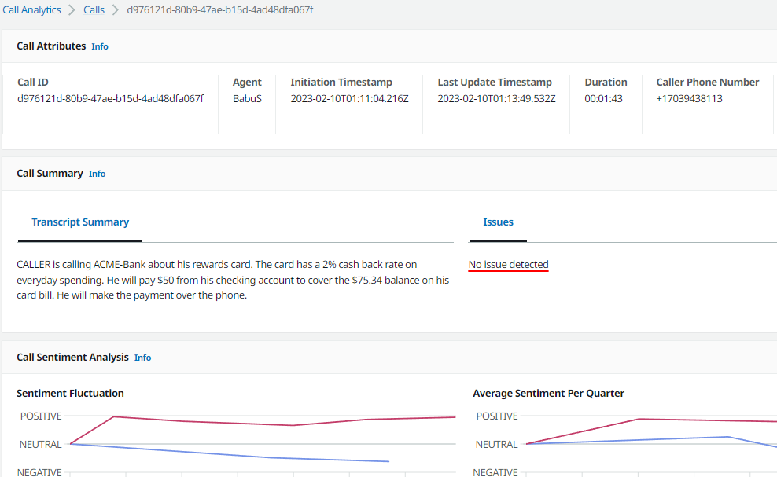

# Transcript Summarization (Experimental Feature)

LCA now supports generating and displaying a short abstractive call transcript summarization (rendered in markdown) in addition to the extractive summarization from Transcribe Call Analytics that provides (real time) detected issues, and (post call) detected action items, and outcomes. Currently this feature is 'experimental'. In later releases we may adopt different techniques and add capabilities based on feedback from early adoption. We encourage experimentation, and feedback!
  
Heres an example of a Transcript Summary:
   

   

When a call ends, LCA's Event Processor Lambda function will check to see if the stack has been configured for summarization. Summarization is configured by choosing an value for the `EndOfCallTranscriptSummary` CloudFormation parameter. Valid values are 
`DISABLED`, `SAGEMAKER`, and `LAMBDA`.

### **DISABLED** (default)

This option disables call transcript summarization.

### **SAGEMAKER**

If you choose the `SAGEMAKER` option, LCA will deploy a Lambda function and  SageMaker endpoint with the [bart-large-cnn-samsum](https://huggingface.co/philschmid/bart-large-cnn-samsum) model. 

By default a 1-node ml.m5.xlarge endpoint is automatically provisioned. For large volume deployments, add additional nodes by setting the parameter `SummarizationSageMakerInitialInstanceCount`. Please check [SageMaker pricing documentation](https://aws.amazon.com/sagemaker/pricing/) for relevant costs and information on Free Tier eligibility. 
  
By setting the parameter `SummarizationSageMakerInitialInstanceCount` to `0`, a [Serverless Sagemaker endpoint](https://docs.aws.amazon.com/sagemaker/latest/dg/serverless-endpoints.html) is enabled. A serverless endpoint can save you money by scaling down to zero when not in use, however, there is a 'cold start' time of approximately 1-2 minutes which can delay the availability of the summary when used after a period of inactivity. LCA creates the serverless endpoint with default 4GB model memory, and max concurrency of 50 requests.  

The `CallEventProcessor` Lambda invokes a pre-configured `SummaryLambda` at the end of a call. The `SummaryLambda` invokes the `FetchTranscript` Lambda (see more details below) to fetch a text based transcript of the call. The transcript is sent to the SageMaker endpoint to generate a summary.  The summary is returned from the `SummaryLambda` to the `CallEventProcessor` and mutated/persisted to AppSync/DynamoDB.

NOTE: The summarization model used in this release limits the input text to 1024 'tokens'. Tokens are words, punctuation, and new lines. Transcriopts that are longer that 1024 tokens are automatically truncated by the `FetchTranscript` lambda to avoid errors when summarizing. This does affect the accuracy of the summary for long calls. We hope to be able to increase this limit by adopting newer models in future releases.

### **LAMBDA**

Use the LAMBDA option to provide your own summarization functions and/or machine learning models. This option allows you to experiment with different models and techniques to customized the summary as you need.

When you choose the `LAMBDA` option, you must provide the Arn of your custom Lambda function in the `EndOfCallLambdaHookFunctionArn` CloudFormation parameter. At the end of a call, the `CallEventProcessor` Lambda function will invoke the custom Lambda and pass in the CallId of the call.

The custom Lambda function must return the summary in the following format:

```
{
  "summary": "Summary of the call here."
}
```

The summary text can optionally use Markdown syntax to include rich text- and/or embedded hyperlinks, images, media, etc.
  
Use the provided [FetchTranscript utility Lambda function ](./FetchTranscriptLambda.md) to retrieve the call transcript, optionally truncated to the maximum input token limit of your summarization model.

If the custom Lambda fails, or you do not want to return a summary for the call, return an empty string for the value of the summary.

## FetchTranscript Utility Lambda

See [FetchTranscriptLambda.md](./FetchTranscriptLambda.md)