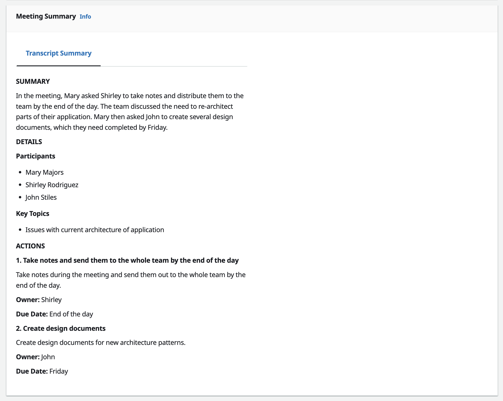
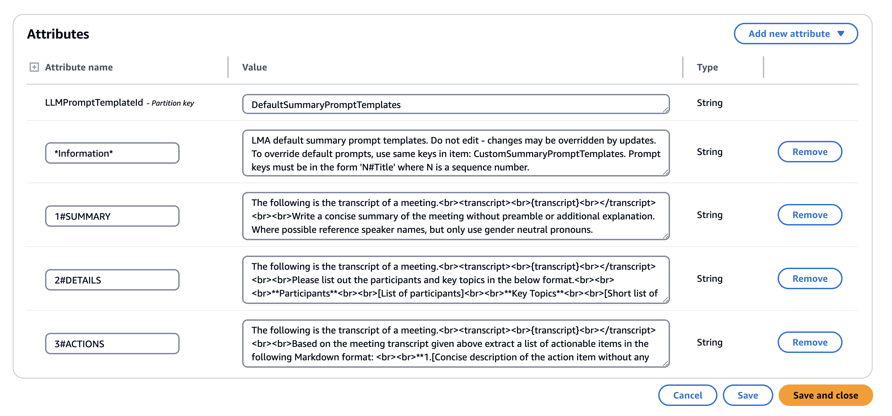
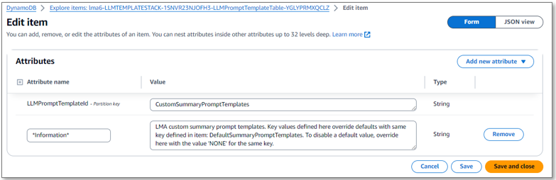

# Transcript Summarization

Live Call Assistant (LCA) summarizes call transcripts once the call is over.


        
You can configure Transcript Summarization by choosing a value for the `EndOfCallTranscriptSummary` CloudFormation parameter when deploying or updating your LCA stack. Valid values are 
`BEDROCK` (default) and `LAMBDA`.
If the `BEDROCK` option is chosen, select a supported model ID from the list (`BedrockModelId` parameter)

### **BEDROCK** (default)

The `BEDROCK` option is enabled by default. You must [request model access](https://docs.aws.amazon.com/bedrock/latest/userguide/model-access.html) for the model selected in the `BedrockModelId` parameter. By default, the selected model is `anthropic.claude-3-haiku-20240307-v1:0`.

LCA can run multiple LLM inferences after the call is complete. The prompt templates used to generate the insights from the transcript are stored in a DynamoDB table. There are two items (records) in the table:  

1. **Default prompt templates:** These come with the LCA release, and define the summaries you get if you do not create custom prompt templates. Default prompts may change in new versions of LCA. View the default prompts by opening the DynamoDB URL in the LCA Stack output `LLMDefaultPromptSummaryTemplate`. 

    

2. **Custom prompt templates:** Initially after deploying LCA, there are no custom prompts defined, but you can add your own. Create custom prompt templates to override or disable default summary prompts, or to add new ones. Custom prompt templates are not overwritten when you update your LCA stack to a new version. View and edit the custom prompts by opening the DynamoDB URL in the LCA Stack output `LLMCustomPromptSummaryTemplate`.

    

The attribute named `**Information**` is ignored by LCA - it is informational only.

All other attributes define the summary prompts that LCA executes when the call is over. Each has an attribute name used as the heading that shows up in the LCA summary, and an attribute value which defines the prompt template used to invoke the selected LLM.  

**Attribute Name:** The attribute name must be formatted using a sequence number `N`, a `#` symbol, and the heading you want to use for the summary in the UI. For example, `1#Summary` defines a heading value of **Summary**, that will always be displayed above other headings with a higher sequence number. LCA removes the sequence number before displaying the title.

**Attribute Value:** The attribute value is used as the prompt template. LCA replaces `<br>` tags with newlines. Use the template variable `{transcript}` to indicate where the call transcript will be placed in the prompt. LCA replaces `{transcript}` with the actual call transcript in the form:
```
<SpeakerName>: <transcription text>
<SpeakerName>: <transcription text>
...
```
LCA invokes the Bedrock model using your prompt, and renders the results in the Summary section of the Call detail page, under your heading.

#### Customizing prompts

**Add a new custom summary:** Edit the Custom prompt templated by opening the DynamoDB URL in the LCA Stack output `LLMCustomPromptSummaryTemplate`. Initially this item has no prompt templates defined, but you can choose **Add new Attribute** to define your own prompt. Use the attribute type **String**. Use the **Attribute Name** format described above, e.g. `#4My Custom Call Insights`, and use **Attribute Value** to define the prompt template as described above.

**Customize default prompts:** To override a default prompt value, provide an alternative prompt template for the same Attribute Name (heading) in the Custom prompt templates. LCA merges the default and custom prompts at runtime, and when both contain the same Attribute Name, the prompt template from the Custom prompt templates table is used instead of the default. *Do not edit the Default prompt templates item directly, as it may be overwritten during future stack updates.*

**Remove default prompts:** Create a custom prompt template attribute with the same name as the default prompt you want to disable, but leave the attribute value empty, or give it the value 'NONE'. When LCA merges the default and custom values, the empty (or 'NONE') valued prompts are skipped.


### **LAMBDA**

Use the LAMBDA option to provide your own summarization functions and/or machine learning models. This option allows you to experiment with different models and techniques to customize the summary as you need.

When you choose the `LAMBDA` option, you must provide the Arn of your custom Lambda function in the `EndOfCallLambdaHookFunctionArn` CloudFormation parameter. At the end of a call, the `CallEventProcessor` Lambda function will invoke the custom Lambda function and pass in the CallId of the call.

Your custom Lambda function must return the summary in the following JSON format:

```
{
  "summary": "Summary of the call here."
}
```

The summary can optionally use Markdown syntax to include rich text, hyperlinks, images, media, etc.

If you would like to include more than one section in the summary, similar to the `BEDROCK` option, you may provide a JSON-encoded string that contains key value pairs as the summary's value. This will render each key as a section header, and the value as the body of the section. The following is an example:
```
{
  "summary": "{\n\"Summary\":\"The weekly report was reviewed.\",\n\"Topic\":\"Weekly Report\",\n\"Follow-Up Actions\": \"John will set up a follow-up call.\"\n}"
}
```
This would be rendered as:


Here is a minimal example of a valid custom summarization Lambda function, written in Python. 
```
import json

def lambda_handler(event, context):
    print(json.dumps(event))
    summary = "Placeholder for actual summary" 
    # call your own model, APIs, or summarization functions here...
    return {
      "summary": summary
    }
``` 

This example function trivially returns a hardcoded string as the summary. Your function will be much smarter, and will implement your custom rules or models.
  
Use the provided [FetchTranscript utility Lambda function ](./FetchTranscriptLambda.md) in your custom summarization Lambda to retrieve the call transcript, and optionally truncated to the maximum input token limit imposed by your summarization model.

If your custom Lambda fails at runtime, or you do not want to return a summary for the call, return an empty string for the value of the summary field.

## FetchTranscript Utility Lambda

See [FetchTranscriptLambda.md](./FetchTranscriptLambda.md)