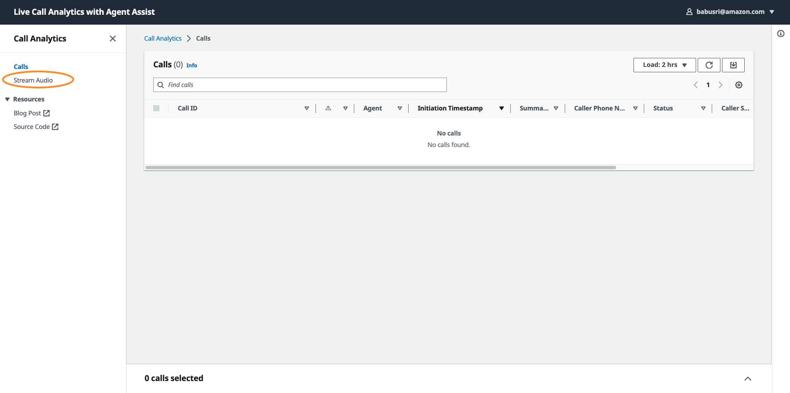
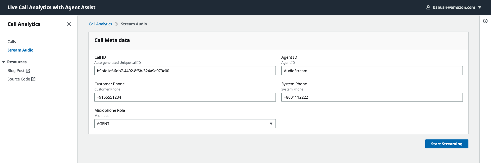
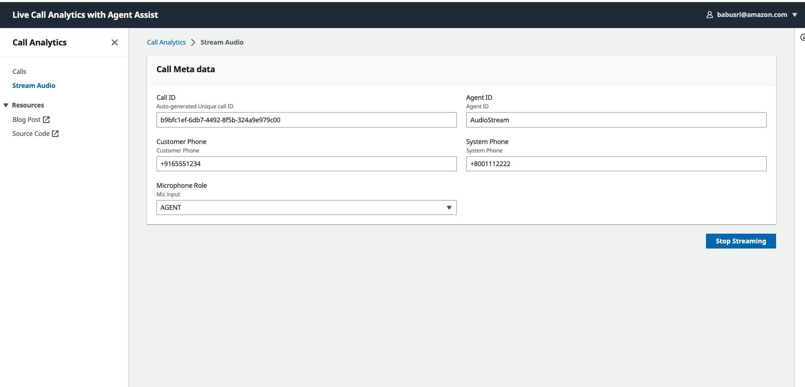

# Web UI Streaming Client

## Introduction
LCA UI offers an option to stream audio from a browser tab+Microphone to LCA/Agent Assist.
Enable the feature `WebSocketAudioInput` when deploying/updating the LCA stack. 

To use this feature:
1. From the LCA UI, click on `Stream Audio` link from the left navigation menu as shown below. 
2. Change default values for Call ID, Agent ID, Customer Phone, and System Phone as needed. Assign a role to the mic input - Agent vs. Caller. 
3. Click on `Start Streaming` as shown below.
4. Share the browser tab that is playing the media (video/audio files, meeting, etc.)
5. Speak into the microphone.
6. The web streaming client combines the audio output from browser tab and the microphone input into a streo (two channel) audio stream. The client sends the stream to the websocket server for downstream processing (enrichment, agent assist, etc.).  
7. Click on `Stop Streaming` to end the streaming session. 

