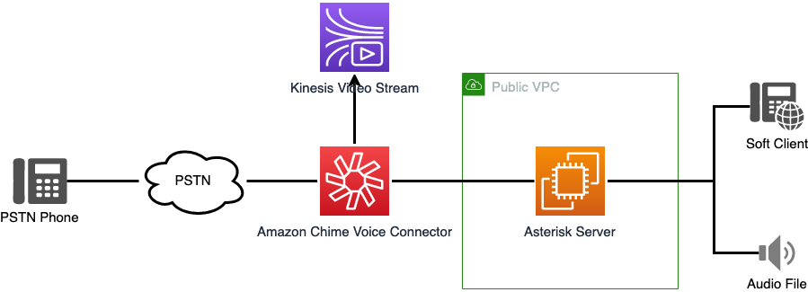
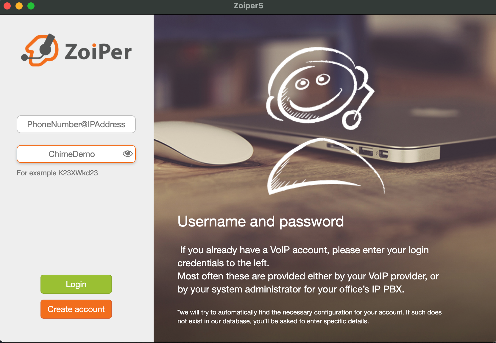
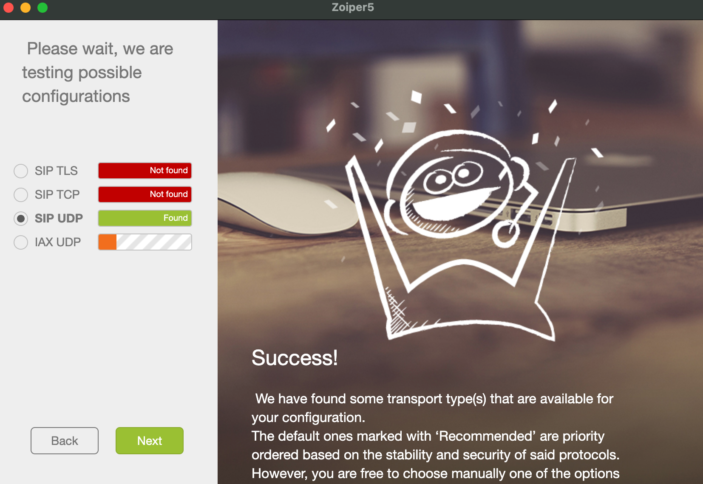

# Using the Asterisk Server with the Live Call Analytics Demo

### Connecting to the Asterisk Server

To connect to the Asterisk server, please use [Session Manager](https://docs.aws.amazon.com/AWSEC2/latest/UserGuide/session-manager.html) within the EC2 console.

### Optional Client Configuration

As part of this deployment, you will be given a chance to include a CIDR block that will be configured as part of a Security Group in your VPC. This will allow you to configure a soft client to register to the Asterisk server and use it to place and recieve calls.

One possible soft client that can be used is [Zoiper](https://www.zoiper.com/) Zoiper is not required, but examples for configuring it are below. Another client could also be used with similar configurations. Refer to their documentation for configuration.

### Login Screen

The PhoneNumber and IPAddress to be used are part of the output and should be copied exactly. The top box will look like: `+12125551234@192.0.2.23` The password to be used is the Instance ID of the Asterisk server. This will be provided in the Cloudformation Output or in the EC2 console.

The next screen will confirm the hostname of the server to connect to. This is the IPAddress and should be filled in already. Skip the Authentication and Outbound Proxy.

## Success

At this point, a UDP connection should be found and you should see this

### Making A Call

At this point, you should be able to make a call to this number or from this number. Be sure to dial a full E.164 number when making a call. It should look like: `+12125551212`. Try it out!

### Recieving A Call

If you do not wish to register a soft client to the Asterisk, you can also call the phone number associated. Without a phone registered, the Asterisk will answer the call and play the agent portion of a sample audio file.

### Asterisk Basics

From terminal of your EC2 Instance:
| Command | Use |
|---|---|
| `sudo bash` | Will allow you to operate as root |
| `cat /var/log/cloud-init-output.log` | View output of initial install script |
| `systemctl status asterisk` | Check the status of asterisk |
| `asterisk -crvvvvv` | Access Asterisk console |

From the Asterisk console:
| Command | Use |
|---|---|
| `pjsip show endpoints` | List the pjsip endpoints |
| `pjsip set logger on` | Enable pjsip logging |
| `core reload` | Reload the configuration files |

Key Asterisk Config Files in the `/etc/asterisk` directory:
| File | Function |
| ----| --- |
| pjsip.conf | Configuration of endpoints |
| extensions.conf | Configuration of call routing |
