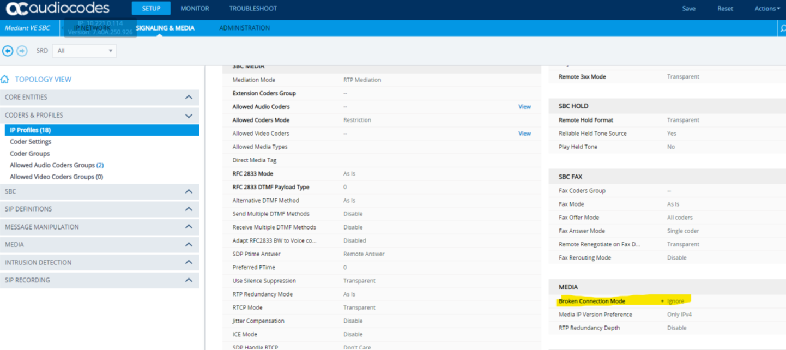

# Using the SIPREC with Amazon Chime SDK Voice Connector and Live Call Analytics Demo

### Configuring Voice Connector with SIPREC

SIPREC connectivity to Amazon Chime SDK Voice Connector offers a way to leverage your existing infrastructure with the features demonstrated here. Amazon Chime SDK Voice Connector endpoints use public IP addresses, so your SBC must allow one-way, outbound connectivity to a range of these IPs defined [here](https://docs.aws.amazon.com/chime-sdk/latest/ag/network-config.html#cvc). This deployment includes an option to configure an Amazon Chime SDK Voice Connector with streaming to be used as a SIPREC endpoint. Additionally, more information can be found [here](https://docs.aws.amazon.com/chime/latest/ag/start-kinesis-vc.html). A comma separated list of CIDR blocks (limit 10) can be entered that will be configured on the Amazon Chime SDK Voice Connector. These CIDR blocks _must_ be public ranges and between a /27 and /32 in size.

#### SBC Configuration Examples

- [CUBE](CUBE_Config.md) Configuration Example

- NOTE - Configure the SBC to use the [RFC 7865](https://www.rfc-editor.org/rfc/rfc7865.html) standard for SipRec Recording Metadata. (Failure to do so can result in missing or erroneous caller channel identification).

- NOTE: If using Audiocodes, be sure to set `BrokenConnectionMode` to `ignore` to avoid premature call ending due to Mute or Hold.
  