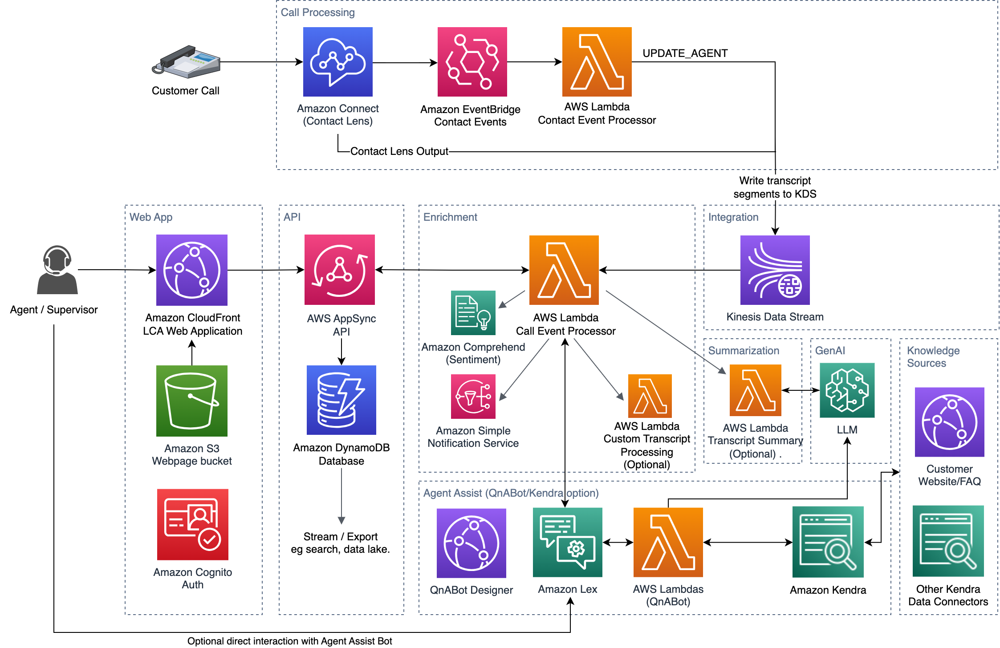

# Integrating the LCA solution with Amazon Connect

## Introduction

LCA integrates with Amazon Connect using Contact Lens [real time contact analysis segment streams](https://aws.amazon.com/blogs/contact-center/provide-call-sentiment-analytics-to-agents-using-real-time-contact-analysis-segment-streams-in-amazon-connect-contact-lens/). 
  
The integration includes the following: 
1. Ingestion of Contact lens transcription / analytics events into LCA (using Kinesis Data Streams)
2. Real time Agent Assist based on caller utterance transcriptions

## Architecture

## Pre-requisites
1. Existing Connect instance and administrator access
2. Phone number
3. Asociated Contact Flow with: 
  2.1 Real Time Contact Lens enabled
  2.2 User defined contact attributes:
     - `LCA Caller Phone Number` (from System attribute `Customer Number`)
     - `LCA System Phone Number` (from System attribute `Dialied Number`)
  2.3 Calls are routed to an active agent queue

#### Deploying Connect instance with sample contact flow
  
Use these steps to quickly deploy a new Connect instance and/or example contact flow. *Skip the first few steps if you already have a Connect instance and just need to create an example contact flow.*  

1. [Launch Amazon Connect](https://docs.aws.amazon.com/connect/latest/adminguide/tutorial1-login-aws.html)  
2. [Create an instance](https://docs.aws.amazon.com/connect/latest/adminguide/tutorial1-create-instance.html)  
3. [Claim a phone number](https://docs.aws.amazon.com/connect/latest/adminguide/tutorial1-claim-phone-number.html)  
4. Choose the Instance Alias you created  
    a. *Copy the Instance ARN shown lower left, and paste into a scratch pad. You'll need it when deploying LCA in the next section.*  
5. Choose the URL **Log in for emergency access**. It will take you the Amazon Connect Administration App  
6. In the Routing menu on the left, choose **Contact flows**  
7. On Contact Flow screen choose **Create contact flow**  
8. Download [LCA example contact flow](./example-contact-flow.json)  
9. Choose the dropdown on the top right and choose **Import Flow (beta)**  
10. Choose the `example-contact-flow.json` file, that you downloaded from step 9, and choose Import  
11. Choose **Save**  
12. Choose **Publish**  
13. From the **Channels** menu on the left, choose **Phone numbers**  
14. Choose the Phone Number created in step 3  
15. In the **Contact Flow / IVR** dropdown, select the Contact Flow you created (`LCA-EXAMPLE`), and choose **Save**   
  
The example contact flow is now published. Open the Connect Contact Control Panel (CCP) application (📞), set it to 'Online'. Make a test call to the  associated phone number, and answer the incoming test call using the CCP application.  

### Cloudformation Deployment
Connect Contact Lens is an optional Audio Source component for the LCA sample solution. 
  
Set the following parameters when deploying the main LCA stack
1. For **Call Audio Source**, choose *Amazon Connect ContactLens*
2. For **Amazon Connect instance ARN (existing)**, enter your Connect instance ARN.

LCA deploys a nested stack, `CONNECTINTEGRATIONSTACK`, which uses an AWS Lambda function, `AssociateInstanceFunction`, to complete the configurintegration ation by calling Connect's `associate_instance_storage_config` API to integrate the Amazon Connect instance with the Kinesis Data Stream of the LCA AISTACK. 

### Testing
When LCA is installed or updated, log in to the LCA web application, and make a test call to your Connect contact flow phone number. Once the call is answered in Connect, it appears as `In progress` on the LCA *Calls* page, displaying the number of the phone you called from. Open the call to see your real time transcript. 

If you deployed LCA with the QnABot Agent Assist option enabled, try the suggested Caller utterances from the provided [agent assist demo script](../lca-agentassist-setup-stack/agent-assist-demo-script.md) to see the Agent Assist messages in action.

