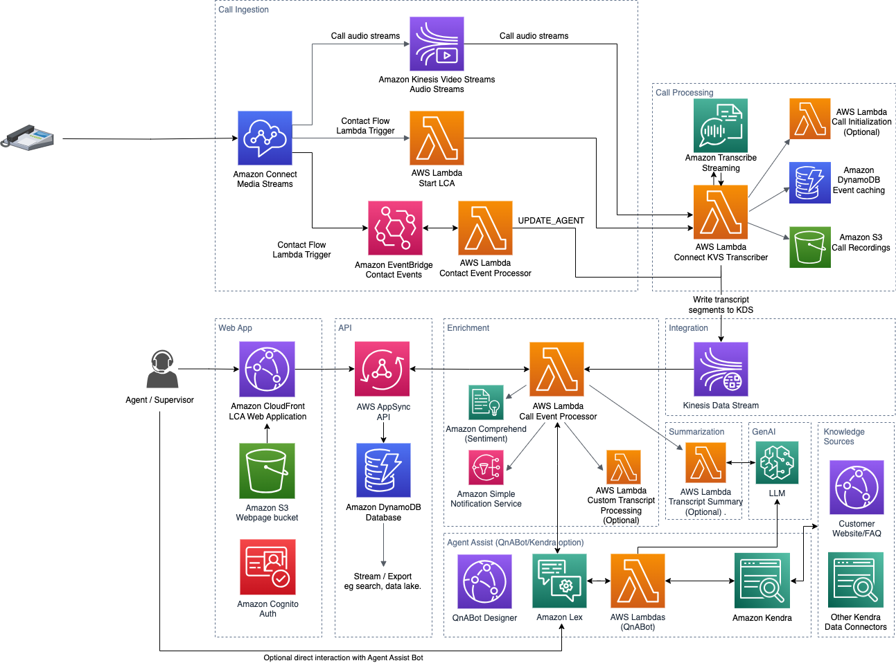

# Amazon Connect Kinesis Video Streams Audio Source

### Introduction

Amazon Connect supports [media streaming](https://docs.aws.amazon.com/connect/latest/adminguide/customer-voice-streams.html) via Amazon Kinesis Video Streams, similar to how Amazon Chime SDK Voice Connector also publishes audio to Kinesis Video Streams. 

This integration allows anyone with Amazon Connect to transcribe and process the raw audio from Kinesis Video Streams with Live-Call Analytics. 

### Architecture

### Pre-requisites:

Use the following steps to create a new Amazon Connect instance. *If you already have an Amazon Connect instance, skip steps 1-3.*

1. [Launch Amazon Connect](https://docs.aws.amazon.com/connect/latest/adminguide/tutorial1-login-aws.html)
2. [Create an instance](https://docs.aws.amazon.com/connect/latest/adminguide/tutorial1-create-instance.html)
3. [Claim a phone number](https://docs.aws.amazon.com/connect/latest/adminguide/tutorial1-claim-phone-number.html)
4. Read through the [plan for live media streaming in Amazon Connect](https://docs.aws.amazon.com/connect/latest/adminguide/plan-live-media-streams.html) page to make sure you have adequate service limits, storage policies, and permissions.
5. Follow the instructions in the [enable live media streaming in Amazon Connect](https://docs.aws.amazon.com/connect/latest/adminguide/enable-live-media-streams.html) page so that your contact flows can stream to Kinesis Video Streams.
6. Find your [Amazon Connect Instance Arn](https://docs.aws.amazon.com/connect/latest/adminguide/find-instance-arn.html) and write it down for the next section. 

### Cloudformation Deployment

`Amazon Connect KVS` is an optional audio source component for LCA. LCA deploys a nested stack named `CONNECTKVSSTACK`, which uses an AWS Lambda function named `StartLCA`, that will be invoked from within an Amazon Connect contact flow block we will configure in a later step. First, we have to install LCA or update an existing stack to use Connect KVS as an audio ingestion source.

1. To configure LCA to use Amazon Connect Kinesis Video Streams, update the main stack (or if you are deploying a new stack). For the **Call Audio Source** parameter, choose `Amazon Connect Kinesis Video Streams`.
2. Scroll down to the **Amazon Connect Instance Arn** and fill in the parameter with your Amazon Connect Instance Arn. It should look similar to *arn:aws:connect:us-east-1:123456789012:instance/123456-1234-1234-1234-123456789012*
2. When the stack is done updating (or deploying), navigate to the main stack outputs and find the *StartLCAFunctionName*  output. Save this value. It should look something like **LCA-CONNECTKVSSTACK-1234567890-StartLCA-1234567890**. 

### Add the LCA Connect KVS Lambda function in Connect

The `StartLCA` Lambda function is what starts the LCA integration process, and it is invoked from a Connect contact flow. You must authorize Amazon Connect to invoke this function.

1. Within the AWS Management Console, navigate to **Amazon Connect**. Select your Amazon Connect instance.
2. Navigate to Flows, and scroll down to AWS Lambda. 
3. Under Lambda Functions dropdown, choose the `StartLCAFunctionName` Lambda Function name from the previous section.  You can quickly find this by typing *StartLCA* in the search box that appears when selecting the dropdown. Select the function when you find it. 
4. Select the **+Add Lambda Function** button. The function should then appear in the list of Lambda Functions below.

### Configure Amazon Connect Contact Flow

Now that Connect has permission to invoke the StartLCA function, you need to configure a contact flow that will invoke it.  You can either configure your own contact flow, or follow the steps below to download and import a sample contact flow. 

#### Import the contact flow template

1. Download [the example contact flow](./lca-contact-flow.json). 
2. Login to your Amazon Connect instance.
3. In the Routing menu on the left, choose **Contact flows**
4. On Contact Flow screen choose **Create contact flow**
5. Choose the dropdown on the top right and choose **Import Flow (beta)**
6. Choose the `lca-contact-flow.json` file that you downloaded from step 1. Choose **Import**.

#### Set the Start LCA function arn

10. Choose the **Start LCA / Invoke AWS Lambda function** block. A details panel should appear on the right side of the screen.
11. Scroll down to **Function Arn** and choose the `StartLCA` Lambda function arn.
12. Choose **Save** from within the *Invoke AWS Lambda function* details panel.

#### Set working queue

13. Choose the **Set working queue** block. A details panel should appear on the right side of the screen.
14. Choose **By queue**, **Set manually**, and choose a queue from the dropdown. Defailt should be **BasicQueue**.
15. Choose **Save** from within the *Set working queue* details panel.

#### Save, publish the contact flow, and assign it to a phone number.

16. Choose **Save** for the entire contact flow.
17. Choose **Publish**
18. From the **Channels** menu on the left, choose **Phone numbers**
19. Choose the Phone Number created in step 3 of the Prerequisites (or choose your existing number).
20. In the **Contact Flow / IVR** dropdown, select the Contact Flow you created (`LCA-EXAMPLE`), and choose **Save**

This contact flow contains a [start media streaming block](https://docs.aws.amazon.com/connect/latest/adminguide/use-media-streams-blocks.html). The media stream block will start streaming audio from the call to Kinesis Video Streams. The block after the media stream block invokes the `StartLCA` Lambda function that will then asynchronously invoke the call transcriber Lambda that will consume the audio from KVS and send it to Transcribe and LCA. 

