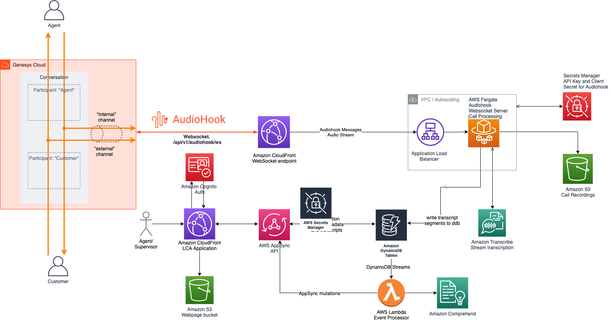

# Genesys Cloud - AudioHook Sample Service

## Introduction
This repo contains code to showcase a sample service that implements the Genesys AudioHook protocol. The implementation includes the following: 
1. ingestion of audio stream from Genesys Cloud via Audiohook protocol
2. transcription of audio stream to text using Amazon Transcribe streaming SDK
3. integration of transcriptions with Live Call Analytics (LCA) sample solution 

## Architecture

## Genesys Audiohook - Deployment and Configuration instructions
### Pre-requisites
1. Instance of Genesys Cloud (with Audiohook integration enabled)
2. AWS Account
3. Deplyoment is via the LCA Main stack

### Cloudformation Deployment
Genesys Audiohook is an optional component of the main LCA sample solution. You can deploy audiohook component by choosing "Genesys Cloud Audiohook Web Socket" for "CallAudioSource" parameter when deploying the LCA main stack.

### Audiohook configuration
The cloudformation stack deploys the proxy service and creates the required resources that enables Genesys Audiohook to send audio stream to LCA. The following resources created by the cloudformation template are required to configure  your instance of Genesys Audiohook audio streaming. You can find references to these resources in the `Outputs` section of the cloudformation stack.

1. WebSocketEndpoint - Websocket service endpoint - `wss://<<xxxxxxxx>>.cloudfront.net/api/v1/audiohook/ws`

    The sample integration service (Fargate containers) is deployed behind an External Loadbalancer. By default, the websocket endpoint is delivered via Cloudfront to avoid having to setup custom domain names for the demo. However, our recommended method is to use a custom domain name (along with an SSL certificate) and map it to external loadbalancer endpoint. You can either use your existing DNS and SSL certificate or use Route53 Hosted Zone for DNS and Amazon Certificate Manager (ACM) for provisioning SSL certificates. In both cases, you need to ensure that your DNS resolves to the external load balancer deployed by this solution. 

2. WebSocketAPIKey - Secrets Manager ARN for API Key 
3. WebSocketAPIClientSecret - Secrets Manager ARN for Client Secret

### Steps to retrieve and configure api key and client secret 
1. Go to your 'AWS Secrets Manager' console and locate the API Key and API ClientSecret resources.

    Navigate to `AWS Secrets Manager -> Secrets -> <<Secret name referenced by WebSocketAPIKey resource>>` to retrieve API Key

    Navigate to `AWS Secrets Manager -> Secrets -> <<Secret name referenced by WebSocketAPIClientSecret resource>>` to retrieve client secret

2. Retrieve key values

    Click on `Retrieve secret value` and copy the `Secret value` for the `Secret key:` `audiohook-api-key`

    Click on `Retrieve secret value` and copy the `Secret value` for the `Secret key:` `audiohook-client-secret`

3. Go to Genesys Cloud Admin console and configure the API key and client secret

    Navigate to `Admin -> Integrations -> Audiohook -> Configuration -> Credentials`

    Click `Change` button to update API Key and Client Secret retrieved from Secrets Manager in steps 1 & 2 above.

    Click `OK` and `Save` to finalize the changes

The audiohook is now ready to stream audio to LCA.

## Genesys Audiohook - LCA Testing
1. Login to Genesys Cloud and access the Agent console. 
2. Call the phone number that is assigned to you in Genesys Cloud
3. Once the call appears in the agent queue, answer the call
4. As soon as the call is connected, you will see the call entry in LCA UI in 'in progress' status
5. Click on the Call ID to see the call details page that includes live turn-by-turn transcripts and sentiment trends

***

Copyright Amazon.com, Inc. or its affiliates. All Rights Reserved.
SPDX-License-Identifier: Apache-2.0

Licensed under the the Apache-2.0 License. See the LICENSE file.
This file is distributed on an "AS IS" BASIS, WITHOUT WARRANTIES OR CONDITIONS OF ANY KIND, express or implied. See the License for the specific language governing permissions and limitations under the License.
