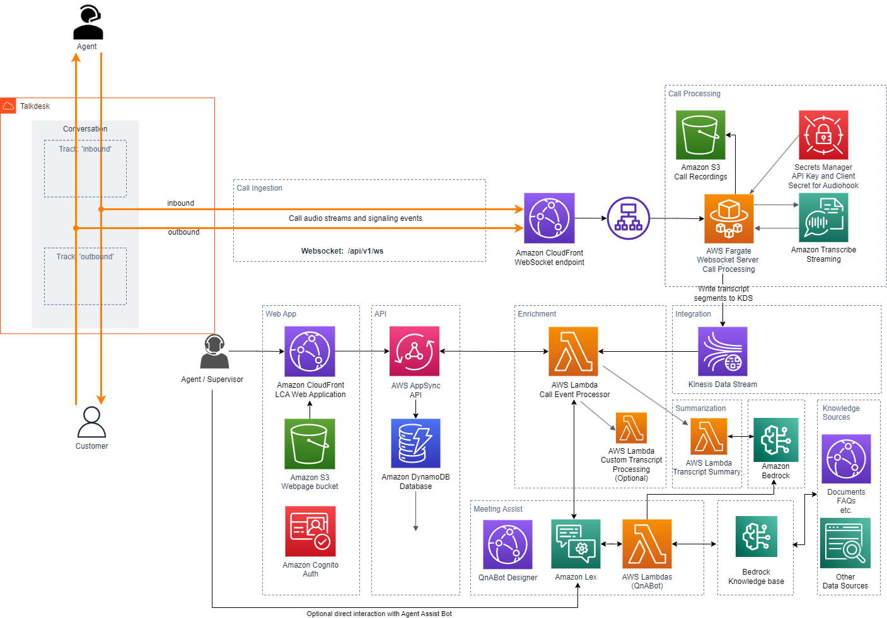

# Talkdesk Conversation Orchestrator Sample Service

## Introduction

This repo contains code to showcase a sample service that implements the [Talkdesk Conversation Orchestrator - Streaming Audio](https://support.talkdesk.com/hc/en-us/articles/8826254684699-Conversation-Orchestrator-Streaming-Unidirectional-Audio) protocol. The implementation includes the following:

1. ingestion of audio streams ('inbound' and 'outbound' tracks) from Talkdesk via Conversation orchestrator - stream audio protocol (over websocket)
2. transcription of audio stream to text using Amazon Transcribe streaming SDK
3. integration of transcriptions into the Live Call Analytics with Agent Assist (LCA) sample solution

> **IMPORTANT**
>
> The code in this repository is provided as a sample blueprint to get started building a websocket server for Talkdesk audio stream.  
> It does not include some of the authentication and resiliency patterns that you will likely require for a production implementation.

## Architecture



## Deployment and Configuration instructions

### Pre-requisites

1. Instance of Talkdesk with Conversation Orchestrator: Unidirectional Audio Stream enabled
2. AWS Account with necessary privileges to deploy the application.
3. Deplyoment is via the LCA Main stack

### Cloudformation Deployment

Talkdesk audio stream is an optional component of the main LCA sample solution. You can deploy Talkdesk component by choosing "Talkdesk Voice Stream Websocket" for "CallAudioSource" parameter when deploying the LCA main stack. You will also need Talkdesk Account ID assigned to your instance of Talkdesk, to deploy the solution. Your Talkdesk admin should be able to provide the account ID. This account ID is used to verify the client (in place of client secret/API key based authentication - Talkdesk audio streaming does not support client secret/API key).

The LCA cloudformation (with Talkdesk as audio source) deploys a Websocket Server with WebSocketEndpoint - Websocket service endpoint - `wss://<<xxxxxxxx>>.cloudfront.net/api/v1/ws`

    The sample integration service (Fargate containers) is deployed behind an External Loadbalancer. By default, the websocket endpoint is delivered via Cloudfront to avoid having to setup custom domain names for the demo. However, our recommended method is to use a custom domain name (along with an SSL certificate) and map it to external loadbalancer endpoint. You can either use your existing DNS and SSL certificate or use Route53 Hosted Zone for DNS and Amazon Certificate Manager (ACM) for provisioning SSL certificates. In both cases, you need to ensure that your DNS resolves to the external load balancer deployed by this solution.

### Talkdesk configuration

The cloudformation stack deploys the websocket server and creates the required resources that enables Talkdesk to send audio stream to LCA. The WebSocketEndpoint resource created by the cloudformation template is required to configure your instance of Talkdesk audio streaming.

1. find the WebsocketEndpoint (url) in the `Outputs` section of the cloudformation stack.

2. From Talkdesk console, navigate to Stream Audio (Conversation Orchestrator) - unidirectional --> AI Voice Streams Settings and specific the WebsocektEndpoint, obtained from LCA cloudformation deployment, in the "Stream URL" field.

## Talkdesk - LCA Testing

1. Login to Talkdesk and access the console.
2. Call the phone number that is assigned to you in Talkdesk
3. As soon as the call is connected, you will see the call entry in LCA UI in 'in progress' status
4. Click on the Call ID to see the call details page that includes live turn-by-turn transcripts and sentiment trends

---

## Test docker build locally after making code changes
```
cd ./lca-talkdesk-voicestream-stack/source/app
npm install
docker build -t lca-talkdesk .
```