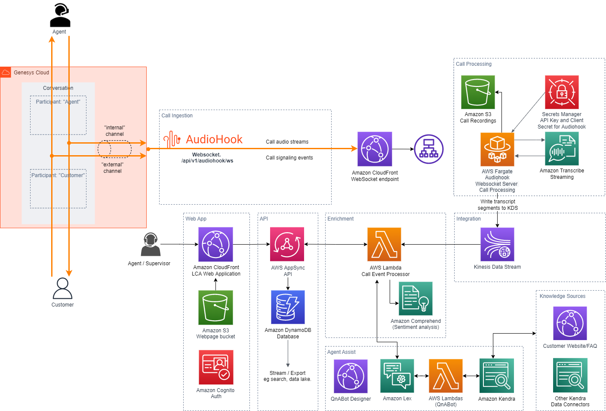

# Websocket server to ingest and Transcribe Web and microphone audio

## Introduction
Websocket server ingests audio from the web client (web and micrphone audio stream), transcribes the audio real time, and writes the transcription events to KDS. 

## Architecture

## Cloudformation Deployment
Websocket server is an optional component of the main LCA sample solution. You can deploy this  component by enabling `WebSocketAudioInput` parameter in the LCA main stack.

The cloudformation stack deploys the websocket server to ECS Fargate and creates an endpoint used by the web client. Check `LCAWebsocketEndpoint` in `Outputs` section of the cloudformation stack.

The websocket server can tested by streaming a call recording using a node client utility. Check `utilities/websocket-client`.