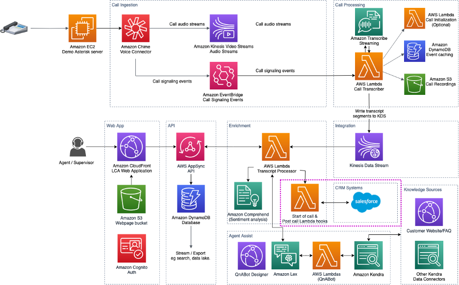
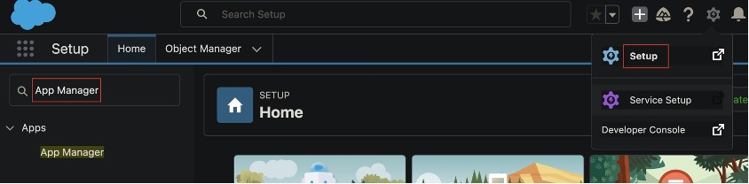
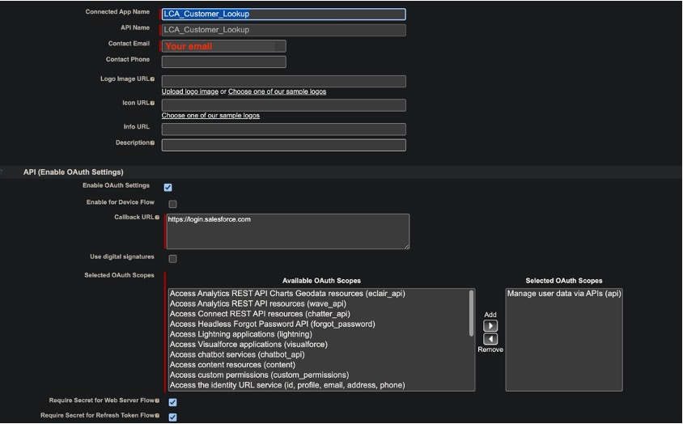
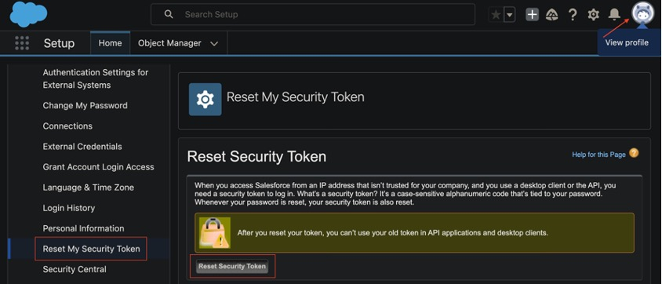
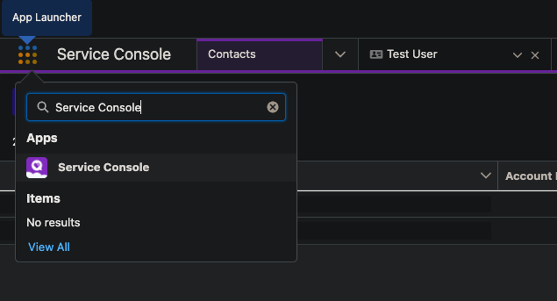
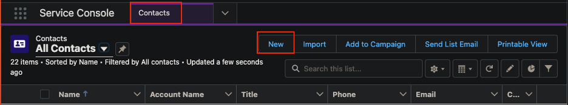

# Boosting agent productivity with Salesforce integration for Live Call Analytics 

As a contact center agent, would you rather focus on having productive
customer conversations or get distracted by having to look up customer
information, knowledge articles that could exist in various systems? We
have all been there: having a productive conversation while multitasking
is challenging. A single negative experience may put a dent on a
customer's perception of your brand.  

The [Live Call Analytics with Agent Assist
(LCA)](https://aws.amazon.com/blogs/machine-learning/live-call-analytics-and-agent-assist-for-your-contact-center-with-amazon-language-ai-services/)
open-source solution addresses some of these challenges by providing
features such as AI powered agent assistance, call transcription, call
summarization, and a lot more. As part of our effort to keep the
solution meeting the demanding needs of your agents, we strive to add
features based on your feedback, and based on our own experience helping
contact center operators. One of the features we added is the ability to
write your own Lambda hooks for the [start of
call](https://github.com/aws-samples/amazon-transcribe-live-call-analytics/blob/main/lca-ai-stack/TranscriptLambdaHookFunction.md)
and
[post-call](https://github.com/aws-samples/amazon-transcribe-live-call-analytics/blob/main/lca-ai-stack/TranscriptSummarization.md)
to custom process calls as they occur. This makes it easier to custom
integrate with LCA architecture without complex modification to the
original source code. It will also let you update LCA stack deployments
quicker and easier than if you were modifying the code directly.

Today, we are excited to announce a feature that lets you integrate LCA
with your Customer Relationship Management (CRM) system, built on top of
the pre and post call Lambda hooks.

The rest of this README will walk you through setting up the LCA/CRM
integration with Salesforce. 

## Solution overview

LCA now has two additional Lambda hooks:

1.  Start of Call Lambda Hook that the LCA Call Event/Transcript
    Processor will invoke at the beginning of each call. This function
    can implement custom logic that applies to the beginning of call
    processing, such as retrieving call summary details logged into a
    case in a CRM. 

2.  Post Call Summary Lambda Hook that the LCA Call Event/Transcript
    Processor will invoke after the call summary is processed. This
    function can implement custom logic that is relevant to post
    processing, for example, updating the call summary to a CRM system.

*Start of call and Post call (summary) Lambda Hooks that integrates with
Salesforce to look-up and update Case records respectively*

We will first complete Salesforce setup to allow the custom Lambda hooks
to look up or update the Case records. We will then deploy the LCA and
Salesforce integration stacks. Finally, we will update the LCA stack
with the Salesforce integration Lambda hooks and perform validations.

## Prerequisites

-   An existing Salesforce organization. Sign up for a free [Salesforce
    Developer Edition](https://developer.salesforce.com/signup)
    organization, if you don\'t have one.

-   An AWS account. If you don't have one, sign up at
    [https://aws.amazon.com](https://aws.amazon.com/).

-   [AWS Command Line Interface](http://aws.amazon.com/cli) (AWS CLI)
    version 2
    [installed](https://docs.aws.amazon.com/cli/latest/userguide/install-cliv2.html).

## Create a Salesforce Connected App

1.  Log in to your Salesforce org and navigate to Setup.

2.  Search for App Manager and choose App Manager.

3.  Choose New Connected App

4.  Provide a name for Connected App Name.

5.  Provide a valid Contact Email.

6.  Choose Enable OAuth Settings and provide a Callback URL

7.  Under Available OAuth Scopes, choose Manage user data via APIs (api)

8.  Ensure that Require Secret for Webserver Flow and Require Secret for
    Refresh Token Flow are selected.

9.  Choose Save.

10. Under API (Enable OAuth Settings, choose Manage Consumer Details.

11. Verify your identity if prompted.

12. Copy the Consumer Key and Consumer Secret. You will need this when
    deploying the SAM application.

## Get your Salesforce access token

If you don\'t already have an access token, you will need to obtain a
new one. Before doing this, ensure that you are prepared to update any
applications that are using an access token as this step will create a
new one, and may invalidate the prior tokens.

1.  Navigate to your personal information by choosing Settings from View
    profile on the top right.

2.  Choose Reset My Security Token followed by Reset Security Token.

3.  Make note of the new security/access token that you receive via
    email.

## Create a Salesforce Customer Contact record for each caller

The Lambda function that performs Case look-up and update matches the
caller's phone number with a contact record in Salesforce.

1.  Login to your Salesforce org.

2.  Under App Launcher, search for Service Console. Choose Service
    Console.

3.  In the Service Console page, choose Contacts from the drop-down
    list, then choose New.

4.  Enter a valid phone number under the Phone field of the New Contact
    page.

5.  Enter other contact details and choose Save.

6.  Repeat Steps 1 through 5 for any caller that will make a phone call,
    and test the integration.

## Deploy the LCA stack

1.  Follow the instructions under the Deploy the CloudFormation stack
    section of the [Live call analytics and agent assist for your
    contact center with Amazon language AI
    services](https://aws.amazon.com/blogs/machine-learning/live-call-analytics-and-agent-assist-for-your-contact-center-with-amazon-language-ai-services/)
    blog post.

2.  Ensure that you choose ANTHROPIC, SAGEMAKER, or LAMBDA  for the End
    of Call Transcript Summary parameter. 

3.  The stacks take about 45 minutes to deploy. 

4.  After the main stack shows CREATE_COMPLETE, navigate to the Outputs
    tab and make a note of the Kinesis Data Stream ARN
    (CallDataStreamArn).

## Deploy the Salesforce integration stack

1.  Open a command-line terminal and run the following commands:

<https://github.com/aws-samples/amazon-transcribe-live-call-analytics.git>\
cd amazon-transcribe-live-call-analytics/plugins/salesforce-integration\
sam build\
sam deploy ---guided

Use the following as a reference for parameter choices:

  --------------------------------------------------------------------------
  **Parameter Name**         **Description**
  -------------------------- -----------------------------------------------
  AWS Region                 The region where you have deployed the LCA
                             solution.

  SalesforceUsername         The user name of your Salesforce organization
                             that has permissions to read and create Cases.

  SalesforcePassword         Password associated to your Salesforce user
                             name.

  SalesforceAccessToken      The secret/access token you obtained from
                             following the instructios under  Get your
                             Salesforce access token section.

  SalesforceConsumerKey      The Consumer Key you copied in Step 12 of the
                             Create a Connected App section.

  SalesforceConsumerSecret   The Consumer Secret obtained from Step 12 the
                             Create a Salesforce Connected App section.

  SalesforceHostUrl          Login URL of your Salesforce organization.

  SalesforceAPIVersion       Salesforce API version (choose default or
                             v56.0)

  LCACallDataStreamArn       The Kinesis Data Stream ARN (CallDataStreamArn)
                             obtained from Step 4 of the Deploy the LCA
                             stack section.
  --------------------------------------------------------------------------

5.  After the stack successfully deploys,  make a note of
    StartOfCallLambdaHookFunctionArn and
    PostCallSummaryLambdaHookFunctionArn from the Outputs displayed on
    your terminal.

## Update LCA Stack

1.  Navigate to CloudFormation console and update the main LCA stack.
    Choose Use current template option with the following values:

2.  For Lambda Hook Function ARN for Custom Start of Call Processing
    (existing) provide the StartOfCallLambdaHookFunctionArn that you
    obtained from Step 5 of the Deploy LCA / Salesforce integration
    stack section.

3.  For Lambda Hook Function ARN for Custom Post Processing, after the
    Call Transcript Summary is processed (existing) provide the
    PostCallSummaryLambdaHookFunctionArn that you obtained from Step 5
    of the Deploy LCA / Salesforce integration stack section.

4.  Ensure that End of Call Transcript Summary **[is no]{.underline}t**
    DISABLED.

## Validate the integration

Make a test call and ensure you are able to see the beginning of call
AGENT ASSIST and post call AGENT ASSIST transcripts. Refer to *Explore
live call analysis and agent assist features* section of the Live call
analytics and agent assist for your contact center with Amazon language
AI services post for guidance. The following video shows the integration
in action:

## Clean up

When you're finished experimenting with this solution, clean up your
resources by following these instructions:

1.  Open the AWS CloudFormation console and delete the LCA stacks that
    you deployed. This deletes resources that were created by deploying
    the solution. The recording S3 buckets, DynamoDB table, and
    CloudWatch Log groups are retained after the stack is deleted to
    avoid deleting your data.

2.  On your terminal, run sam delete to delete the Salesforce
    integration Lambda functions.

3.  Follow the instructions in [Deactivate a Developer Edition
    Org](https://help.salesforce.com/s/articleView?id=sf.admin_deactivate_org.htm&type=5&language=en_US)
    to deactivate your Salesforce Developer org.

## Conclusion

In this guided walk-through, we demonstrated how the Live-Call Analytics sample project
can accelerate customers adoption of real-time contact center analytics
and integration. Rather than build from scratch, we show how to utilize
the existing codebase with the pre-built integration points with the
start-of-call and post-call Lambda hooks to enhance agent productivity
by integrating with Salesforce to look up and update Case records. 
