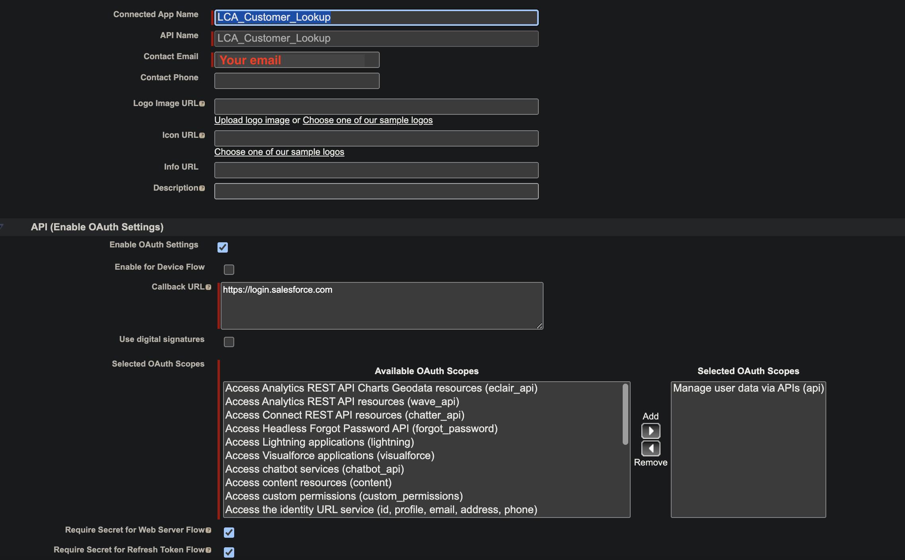

# Integrating the LCA solution with Salesforce for Agent Assist

## Introduction

LCA gives you options to bring your own Lambda hooks for custom processing during call initiation and after call summaries are generated (if enabled). You can use these hooks to enhance the agent assist experience by adding logic to integrate with external systems to pull contextual information at the beginning of each call to help agents better connect with their customers. The post call summary Lambda hook can be used to add logic to create ticket/cases automatically with the call summary (if enabled).

We provide a reference implementation with instructions to deploy this optional integration with Salesforce to pull Case records during call initiation, and create a Case with the call summary as the description when the call ends.

## Architecture

## Pre-requisites
1. An existing Salesforce organization. Sign up for a free [Salesforce Developer Edition](https://developer.salesforce.com/signup) organization, if you don't have one.

## Salesforce set up

### Create a Connected App 

1. Log in to your Salesforce org and navigate to `Setup.`
2. Search for `App Manager` and choose `App Manager.`
3. Choose `New Connected App`
4. Provide a name for `Connected App Name.`
5. Provide a valid `Contact Email.`
6. Choose `Enable OAuth Settings` and provide a `Callback URL`
7. Under `Available OAuth Scopes`, choose `Manage user data via APIs (api)`
8. Ensure that `Require Secret for Webserver Flow` and `Require Secret for Refresh Token Flow` are selected.
9. Choose Save.

10. Under `API (Enable OAuth Settings`, choose `Manage Consumer Details`.
11. Verify your identity if prompted.
12. Copy the `Consumer Key` and `Consumer Secret`. You will need this when deploying the SAM application.

### Get your access token

If you don't already have an access token, you will need to obtain a new one. Before doing this, ensure that you are prepared to update any applications that are using an access token as this step will create a new one, and may invalidate the prior tokens.

1. Navigate to your personal information by choosing `Settings` from `View profile` on the top right.
2. Choose `Reset My Security Token` followed by `Reset Security Token`.
3. Make note of the new security/access token that you receive via email.

## SAM Deployment

1. Open a command-line terminal, and switch to `integration/salesforce` under the LCA root folder.
2. Run the following commands. 
   1. sam build
   2. sam deploy --guided

      | Parameter Name   | Description      |                   
      | ---  | ---                |
      | Stack Name       | Provide a stack name                                                                         |
      | AWS Region       | The region where you have LCA set up                                                         |
      | SalesforceUsername | The user name of your Salesforce organization that has permissions to read and create Cases. |
      | SalesforcePassword | Password associated to your Salesforce user name.                                            |
      | SalesforceAccessToken  | The secret/access token you obtained from following the `Get your access token` section.     |
      | SalesforceConsumerKey  | The Consumer Key you copied in Step 12 of the `Create a Connected App` section.              |
      | SalesforceConsumerSecret | The Consumer Secret you copied in Step 12 of the `Create a Connected App` section.           |
      | SalesforceHostUrl  | Login URL of your Salesforce org.                                                            |
      | SalesforceAPIVersion | Salesforce API version (choose default or v56.0)                                             |
      | LCACallDataStreamArn  | The ARN of the LCA Kinesis Data Stream                |
3. Make a note of `StartOfCallLambdaHookFunctionArn` and `PostCallSummaryLambdaHookFunctionArn` from the Outputs.

## LCA Stack update
Update your LCA stack and provide the following values:
1. For `Lambda Hook Function ARN for Custom Start of Call Processing (existing)` provide the Lambda ARN from the SAM Output (`StartOfCallLambdaHookFunctionArn`).
2. For `Lambda Hook Function ARN for Custom Post Processing, after the Call Transcript Summary is processed (existing)` provide the Lambda ARN from the SAM Output (`PostCallSummaryLambdaHookFunctionArn`) 
3. Ensure that `End of Call Transcript Summary` is not `DISABLED`.

## Testing
Make a test call and ensure you are able to see beginning of call AGENT ASSIST and post call AGENT ASSIST transcripts.   
